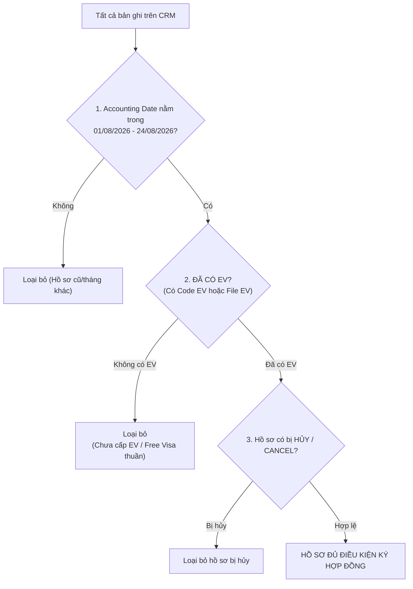

# QUY CHUẨN: CÁCH LỌC, LẤY DỮ LIỆU VÀ TÍNH TOÁN TIỀN CHO CÁC LOẠI KHÁCH VÀ VISA
*(Tài liệu chuẩn hóa tự động tạo hợp đồng và theo dõi thay đổi dữ liệu từ CRM Lark Base)*

---

## MỤC 1. QUÁ TRÌNH LỌC DỮ LIỆU TỪ CRM LARK BASE
Dữ liệu được truy vấn tự động qua Open API của Lark Base (`TABLE_ID: tbluosVi3sQS9gIS`) với 2 tiêu chí bắt buộc:



### 1. Tiêu chí thời gian:
* Lọc chính xác theo trường `Accounting Date` trong khoảng timestamp:
  $$\text{Timestamp}(01/08/2026\text{ 00:00:00}) \le \text{Accounting Date} \le \text{Timestamp}(24/08/2026\text{ 23:59:59})$$
* Không sử dụng `Event Date` làm fallback.

### 2. Tiêu chí trạng thái cấp thị thực (Đã có EV):
* Hồ sơ bắt buộc phải có thông tin tại cột `Code EV` (chuỗi ký tự mã hồ sơ EV) hoặc có tệp đính kèm tại cột `EV`.
* Các trường hợp khách thuộc diện Miễn thị thực thuần túy (`Free Visa - Bo Y`, `Free Visa - Cam` nhưng không xin E-Visa) hoặc hồ sơ chưa có mã EV (ví dụ: Gary John Busby tháng 8 không có EV) sẽ bị loại bỏ để đảm bảo hợp đồng xuất ra chỉ dành cho khách đã hoàn tất dịch vụ.

### 3. Tiêu chí loại bỏ hồ sơ hủy / cancel:
* Bất kỳ hồ sơ nào có gắn tag hoặc ghi chú `(cancel)`, `hủy`, `huy` đều tự động bị loại bỏ (ví dụ: `KONDRATEVA EKATERINA (cancel)`).

---

## MỤC 2. CÁCH TRÍCH XUẤT DỮ LIỆU ĐƯA VÀO HỢP ĐỒNG
Mỗi bản ghi được ánh xạ (mapping) chính xác vào mẫu Hợp đồng 7 trang song ngữ (PDF & Word DOCX):

| Trường thông tin Hợp đồng | Cột trích xuất trên CRM | Cách xử lý & Định dạng |
| :--- | :--- | :--- |
| **Số Hợp đồng** | Số thứ tự tự tăng | Đánh số thứ tự định dạng 3 chữ số: `001`, `002`, ..., `114`. |
| **Ngày ký Hợp đồng** | `Accounting Date` | Chuyển timestamp thành ngày song ngữ:<br>• Tiếng Việt: `ngày 12 tháng 08 năm 2026`<br>• Tiếng Anh: `August 12, 2026` |
| **Họ và tên Bên A** | Tên khách (`Name`) | Lấy chuỗi text và chuyển thành **IN HOA ĐẬM** (`VOEVODIN FEDOR`). |
| **Quốc tịch Bên A** | Quốc tịch (`National`) | Chuẩn hóa tên quốc gia song ngữ (ví dụ: `Nga / Russian`, `Thổ Nhĩ Kỳ / Turkish`, `Mỹ / American`, ... - không để `N/A`). |
| **Số Hộ chiếu Bên A** | `Code EV` / File EV | Dùng Regular Expression `(r'[A-Za-z0-9]{7,9}$')` để trích xuất 7–9 ký tự số hộ chiếu ở cuối mã code EV. |
| **Ngày cấp Hộ chiếu** | Mặc định | `20/05/2022` |
| **Thông tin Bên B** | Cố định công ty | Công ty TNHH Du lịch Quốc tế EasyTrip, MST, Địa chỉ, Người đại diện. Chức danh chữ ký Bên B: **GIÁM ĐỐC / DIRECTOR**. |
| **Chữ ký điện tử Bên A** | Cột `Ảnh hộ chiếu` | Tự động tải ảnh hộ chiếu gốc, cắt vùng chữ ký, tách nền trong suốt PNG và chèn tự động vào trang 7. |

---

## MỤC 3. QUY TẮC PHÂN LOẠI KHÁCH HÀNG & LOẠI VISA

### 1. Phân loại Khách hàng:
* **Đại lý (Chỉ gồm đúng 3 đại lý)**: Cột `Nguồn( Channel)` chứa:
  * `Bolot`, `Sergei`, `Arsenii`
* **Khách lẻ (Toàn bộ các nguồn còn lại)**:
  * Kênh mạng xã hội: `Zalo`, `WhatsApp`, `Facebook`, `Telegram`, `Email`, `Direct`.
  * Các đối tác/nguồn khác: `Mr.Vong`, `Iuliia Sotckaia`, `Alex`, `Love Vietnam`, `Noura`, v.v.

### 2. Phân loại Loại Visa (Cấu trúc 3 nhóm):
1. **Visa Campuchia**: Cột `Loại dịch vụ (type)` có tag `Visa Cambodia` (hoặc `Visa Cam`) VÀ có cột `Lệ phí visa Cam for AI` (hoặc lệ phí thực tế).
2. **Multi**: Khách không làm Visa Cam, và cột `Ghi chú` hoặc `Loại dịch vụ (type)` có chứa từ khóa `Multi / Multiple`.
3. **Single**: Tất cả các trường hợp làm Visa Việt Nam 1 lần còn lại (kể cả các tuyến `90D - Bo Y`, `90D - Cambodia`).

---

## MỤC 4. TOÀN BỘ CÔNG THỨC TÍNH TOÁN CHI PHÍ
Bảng chi phí tại **Điều 2.1** của Hợp đồng được quy chuẩn thành 2 dòng gộp và số tiền hoàn lại tại **Điều 5.2** được tính theo 6 bước:

```text
┌────────────────────────────────────────────────────────────────────────────┐
│                             TỔNG TIỀN HỢP ĐỒNG                             │
│       (Khách lẻ = Sales CRM)      │     (Đại lý = Sales CRM x 108%)        │
└─────────────────────────────────────┬──────────────────────────────────────┘
                                      │
              ┌───────────────────────┴───────────────────────┐
              ▼                                               ▼
┌───────────────────────────────────┐       ┌───────────────────────────────────┐
│  DÒNG 1: PHÍ DỊCH VỤ GỘP (MỤC 1)  │       │ DÒNG 2: LỆ PHÍ NHÀ NƯỚC VN (MỤC 2)│
│  (Bao gồm: Phí tư vấn thuần       │       │ • Single: 662.500đ ($25)          │
│   + Phí xe Bờ Y/Mộc Bài           │       │ • Multi: 1.325.000đ ($50)         │
│   + Lệ phí Visa Cam 1.000.000đ)   │       │ • Free Visa VN: 0đ                │
└─────────────────┬─────────────────┘       └───────────────────────────────────┘
                  │
                  ▼
┌────────────────────────────────────────────────────────────────────────────┐
│                 SỐ TIỀN HOÀN LẠI KHI RỚT VISA (ĐIỀU 5.2)                   │
│ = Phí dịch vụ gộp (Mục 1) - Phí xe (nếu có) - Lệ phí Visa Cam (1.000.000đ) │
│ (Chỉ hoàn lại đúng Phí dịch vụ tư vấn thuần túy)                           │
└────────────────────────────────────────────────────────────────────────────┘
```

### Chi tiết các công thức tính:
* **Bước 1: Tính Tổng tiền Hợp đồng**:
  * Khách lẻ: $\text{Tổng tiền HĐ} = \text{Sales revenue (Đã bao gồm thuế)}$
  * Đại lý: $\text{Tổng tiền HĐ} = \text{Round}(\text{Sales revenue} \times 1.08) \text{ (Giá gốc + 8% VAT)}$
* **Bước 2: Xác định Lệ phí Nhà nước Việt Nam (Mục 2)**:
  * E-Visa Single: `662.500 VNĐ` (Tương đương $25)
  * E-Visa Multi: `1.325.000 VNĐ` (Tương đương $50)
  * Free Visa VN: `0 VNĐ`
* **Bước 3: Xác định Lệ phí Visa Campuchia**:
  * Khách làm Visa Cam: Lấy từ cột `Lệ phí visa Cam for AI = 1.000.000 VNĐ` (hoặc lệ phí thực tế)
  * Khách không làm Visa Cam: `= 0 VNĐ`
* **Bước 4: Xác định Chi phí Vận tải (Phí xe)**:
  * Tuyến Bờ Y (`90D - Bo Y` / `Free Visa - Bo Y`): `1.250.000 VNĐ`
  * Tuyến Mộc Bài / Campuchia (`90D - Cambodia` / `Mộc Bài`): `1.290.000 VNĐ`
  * Các tuyến khác (nội địa, sân bay): `0 VNĐ`
* **Bước 5: Tính Phí Dịch vụ gộp (Dòng 1 trong Hợp đồng)**:
  $$\text{Phí dịch vụ gộp (Mục 1)} = \text{Tổng tiền HĐ} - \text{Lệ phí Nhà nước VN (Mục 2)}$$
* **Bước 6: Tính Số tiền Hoàn lại khi rớt Visa (Điều 5.2)**:
  $$\text{Hoàn phí Điều 5.2} = \text{Phí dịch vụ gộp (Mục 1)} - \text{Phí vận tải} - \text{Lệ phí Visa Cam}$$

---

## MỤC 5. BẢNG TỔNG HỢP PHÂN LOẠI & MINH HỌA HỒ SƠ

| Phân loại | Số lượng | Ví dụ khách hàng | Doanh thu CRM | Tổng tiền HĐ | Lệ phí VN (Mục 2) | Phí DV gộp (Mục 1) | Phí xe | Phí Cam AI | Hoàn phí Điều 5.2 |
| :--- | :---: | :--- | :---: | :---: | :---: | :---: | :---: | :---: | :---: |
| **Khách lẻ - Single** | 25 | VOEVODIN FEDOR (Zalo) | 2.670.000đ | 2.670.000đ | 662.500đ | 2.007.500đ | 1.250.000đ | 0đ | 757.500đ |
| **Khách lẻ - Multi** | 1 | Christopher Simon Purdie (FB) | 4.549.135đ | 4.549.135đ | 1.325.000đ | 3.224.135đ | 0đ | 0đ | 3.224.135đ |
| **Khách lẻ - Visa Cam (Single VN)** | 3 | VLADIMIR COKINA (FB) | 4.400.000đ | 4.400.000đ | 662.500đ | 3.737.500đ | 1.290.000đ | 1.000.000đ | 1.447.500đ |
| **Khách lẻ - Visa Cam (Multi VN)** | 1 | LACEY JASON WILLIAM (Zalo) | 6.000.000đ | 6.000.000đ | 1.325.000đ | 4.675.000đ | 1.290.000đ | 1.000.000đ | 2.385.000đ |
| **Đại lý - Single** | 62 | DUMAN TOLGAHAN (Bolot) | 2.500.000đ | 2.700.000đ | 662.500đ | 2.037.500đ | 1.250.000đ | 0đ | 787.500đ |
| **Đại lý - Multi** | 22 | PILETSKII ALEKSANDR (Sergei) | 3.780.000đ | 4.082.400đ | 1.325.000đ | 2.757.400đ | 1.250.000đ | 0đ | 1.507.400đ |
| **TỔNG CỘNG** | **114** | *(Đã lọc sạch hồ sơ hủy & Free Visa thuần không có EV)* | | | | | | | |

---

## MỤC 6. KẾT QUẢ ĐẦU RA VÀ TÀI LIỆU LƯU TRỮ

### 1. Hệ thống cây thư mục Hợp đồng PDF & DOCX:
```text
output_contracts_01_08_den_24_08/
├── PDF/
│   ├── Khach_Le/
│   │   ├── Single/
│   │   ├── Multi/
│   │   └── Visa_Campuchia/
│   └── Dai_Ly/
│       ├── Single/
│       └── Multi/
└── DOCX/
    ├── Khach_Le/
    │   ├── Single/
    │   ├── Multi/
    │   └── Visa_Campuchia/
    └── Dai_Ly/
        ├── Single/
        └── Multi/
```

### 2. Bảng kê Đối soát 17 cột Excel:
File kết quả: `danh_sach_hop_dong_01_08_den_24_08.xlsx` gồm 17 cột chi tiết:
1. `STT` (001, 002, ...)
2. `Họ và tên Bên A`
3. `Số Hộ Chiếu`
4. `Quốc Tịch`
5. `Ngày Hạch Toán`
6. `Kênh Nguồn`
7. `Phân Loại Khách Hàng`
8. `Phân Loại Visa`
9. `Tuyến / Dịch Vụ`
10. `Doanh Thu CRM (VNĐ)`
11. `Tổng Tiền HĐ (VNĐ)`
12. `Lệ Phí Nhà Nước VN (Mục 2)`
13. `Phí Dịch Vụ Gộp (Mục 1)`
14. `Chi Phí Vận Tải (Phí xe)`
15. `Lệ Phí Visa Cam`
16. `Số Tiền Hoàn Lại Khi Rớt Visa (Điều 5.2)`
17. `Tên File Hợp Đồng`

---

## MỤC 7. CƠ CHẾ TỰ ĐỘNG PHÁT HIỆN THAY ĐỔI DỮ LIỆU CRM (CHANGE DETECTION & AUDIT LOG)

Hệ thống được trang bị bộ lưu vết snapshot (`contract_snapshot.json`). Mỗi khi chạy tạo hợp đồng:
1. **So sánh tự động**: Hệ thống so sánh từng trường dữ liệu giữa CRM hiện tại và snapshot lần chạy trước.
2. **Phát hiện và báo cáo chi tiết**:
   * 🟢 **Hồ sơ mới**: Tên khách, Doanh thu, Kênh nguồn, Loại Visa.
   * 🟡 **Hồ sơ có thay đổi**: Chỉ rõ chính xác trường nào thay đổi (Ví dụ: Doanh thu cũ $\rightarrow$ Doanh thu mới, Số hộ chiếu cũ $\rightarrow$ Số hộ chiếu mới, Đổi loại visa, Bổ sung lệ phí Cam, v.v.).
   * 🔴 **Hồ sơ bị loại bỏ/hủy**: Các hồ sơ bị hủy hoặc không còn thỏa mãn tiêu chí EV.
3. **Cập nhật hợp đồng mới**: Tự động sinh lại file Word DOCX và PDF mới nhất cho các hồ sơ có sự thay đổi.
4. **Ghi nhật ký thay đổi**: Xuất báo cáo ra file `LICH_SU_THAY_DOI_HOP_DONG.md` để người dùng kiểm tra đối soát bất kỳ lúc nào.

---

## MỤC 8. LỆNH THỰC THI

Để chạy tạo hợp đồng và kiểm tra thay đổi dữ liệu CRM:
```bash
# Windows
python batch_generate_by_accounting_date.py

# MacOS
/Users/phamtranthuyvy/Projects/chatbot-easytrip/venv/bin/python batch_generate_by_accounting_date.py
```
