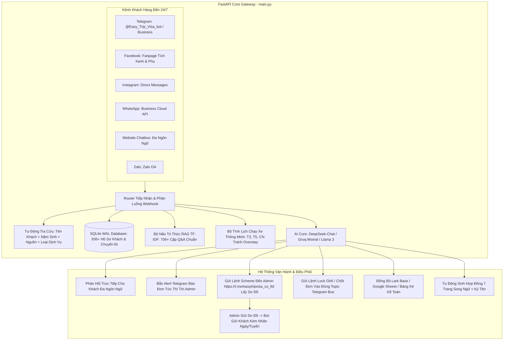
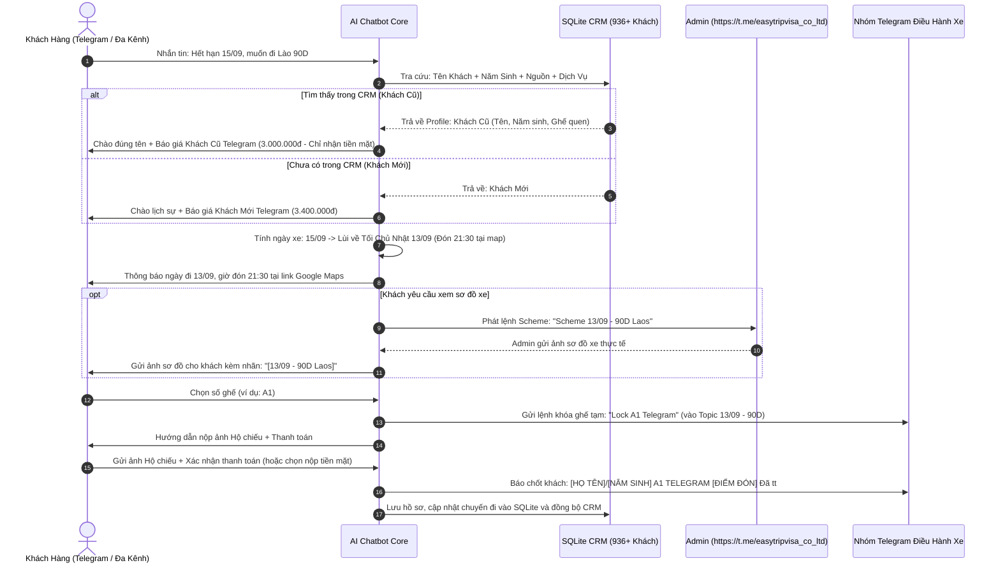

# 📘 QUY TRÌNH HOẠT ĐỘNG TOÀN DIỆN VẬN HÀNH AI CHATBOT EASY TRIP & VISA

> **Phiên bản**: 4.1 (Cập nhật Bảng Giá Chuẩn Telegram, Điểm Đón Google Maps & Quy Trình Lấy Sơ Đồ Xe Qua Kênh Admin)  
> **Áp dụng cho**: Toàn bộ hệ thống AI Chatbot, Nhân viên Điều hành, CSKH & Quản trị viên Easy Trip & Visa.

---

## 📑 MỤC LỤC
1. [Kiến Trúc Đa Kênh Toàn Diện & Luồng Xử Lý (Omnichannel Flow)](#1-kiến-trúc-đa-kênh-toàn-diện--luồng-xử-lý-omnichannel-flow)
2. [Cơ Chế Báo Đơn Tức Thì & Giám Sát Admin Real-time (Telegram Alert)](#2-cơ-chế-báo-đơn-tức-thì--giám-sát-admin-real-time-telegram-alert)
3. [Hai Chế Độ Vận Hành: Tự Động (Auto Mode) & Bán Tự Động (Co-Pilot Mode)](#3-hai-chế-độ-vận-hành-tự-động-auto-mode--bán-tự-động-co-pilot-mode)
4. [Quy Trình 5 Giai Đoạn Phục Vụ Khách Hàng Khép Kín](#4-quy-trình-5-giai-đoạn-phục-vụ-khách-hàng-khép-kín)
5. [Phân Định Khách Hàng: Mới (New), Cũ (Returning), VIP & Đại Lý](#5-phân-định-khách-hàng-mới-new-cũ-returning-vip--đại-lý)
6. [Bảng Giá Bán Lẻ & Bảng Giá Ưu Đãi Khách Cũ (Chuẩn Telegram & Các Kênh)](#6-bảng-giá-bán-lẻ--bảng-giá-ưu-đãi-khách-cũ-chuẩn-telegram--các-kênh)
7. [Thuật Toán Lịch Xe Tránh Quá Hạn Visa & Điểm Đón Chuẩn (Anti-Overstay Scheduling)](#7-thuật-toán-lịch-xe-tránh-quá-hạn-visa--điểm-đón-chuẩn-anti-overstay-scheduling)
8. [Quy Trình Lấy Sơ Đồ Xe (Scheme) & Lệnh Điều Hành Nhóm Telegram](#8-quy-trình-lấy-sơ-đồ-xe-scheme--lệnh-điều-hành-nhóm-telegram)
9. [Hệ Thống Tự Động Quét & Nhắc Hết Hạn Visa Trước 10 Ngày](#9-hệ-thống-tự-động-quét--nhắc-hết-hạn-visa-trước-10-ngày)
10. [Tự Động Hóa Tạo Hợp Đồng Song Ngữ (7 Trang) & Kế Toán CRM](#10-tự-động-hóa-tạo-hợp-đồng-song-ngữ-7-trang--kế-toán-crm)
11. [Hướng Dẫn Triển Khai, Khởi Chạy & Bảo Mật Webhook](#11-hướng-dẫn-triển-khai-khởi-chạy--bảo-mật-webhook)

---

## 🏗️ 1. KIẾN TRÚC ĐA KÊNH TOÀN DIỆN & LUỒNG XỬ LÝ (OMNICHANNEL FLOW)

Hệ thống kết nối đa nền tảng qua Backend FastAPI tập trung, tích hợp bộ nhớ bền vững SQLite (WAL Mode), RAG TF-IDF, và các mô hình AI LLM (DeepSeek / Groq Fallback).



---

## 🔔 2. CƠ CHẾ BÁO ĐƠN TỨC THÌ & GIÁM SÁT ADMIN REAL-TIME (TELEGRAM ALERT)

Mỗi khi có khách hàng gửi tin nhắn từ bất kỳ kênh nào, hàm `notify_admin_incoming_message` lập tức gửi thông báo đẩy trực tiếp tới Telegram Admin (`ADMIN_TELEGRAM_ID`) hoặc Nhóm Quản Trị (`ADMIN_GROUP_CHAT_ID`).

### 2.1. Cấu Trúc Thông Báo Admin:
* **Tiêu đề cảm xúc, thân thiện**:
  - `🚀 Nổ đơn kìa sếp ơi!`
  - `💃 Khách iu ghé thăm!`
  - `🔥 Có khách cần chốt visa kìa sếp!`
  - `✨ Khách quen quay lại!`
* **Thông tin định danh khách (Tra cứu từ SQLite 936+ hồ sơ)**:
  - Tên hiển thị / Họ tên thật.
  - Năm sinh.
  - Kênh tiếp nhận / Nguồn (Telegram / Facebook / WhatsApp / Zalo / Web).
  - Loại dịch vụ khách đã/đang quan tâm (Visarun Lào 90D/45D, Mộc Bài...).
* **Nội dung cuộc hội thoại**:
  - 💬 **Khách nhắn**: Trích xuất chính xác câu hỏi/yêu cầu của khách.
  - 🤖 **Bot đã phản hồi**: Hiển thị câu trả lời mà Bot đã gửi cho khách (Auto Mode) hoặc câu trả lời nháp (Co-Pilot Mode).

---

## ⚙️ 3. HAI CHẾ ĐỘ VẬN HÀNH: TỰ ĐỘNG (AUTO MODE) & BÁN TỰ ĐỘNG (CO-PILOT MODE)

| Đặc Điểm | 🤖 TỰ ĐỘNG (AUTO MODE - Mặc Định) | 🧑‍💻 BÁN TỰ ĐỘNG (CO-PILOT / HUMAN MODE) |
| :--- | :--- | :--- |
| **Mục đích** | Phản hồi siêu tốc 24/7, không để khách chờ dù chỉ 1 giây. | Áp dụng khi đào tạo nhân viên mới, thử nghiệm kịch bản giá mới hoặc kiểm soát 100% nội dung. |
| **Hành vi Bot** | AI tự động phân tích và gửi ngay câu trả lời cho khách. | AI soạn bản nháp (Draft Reply) kèm độ tự tin (Confidence %). |
| **Vai trò Admin** | Nhận thông báo giám sát qua Telegram; can thiệp khi cần. | Bấm **Duyệt & Gửi (Approve)** hoặc **Sửa & Dạy Bot (Edit & Teach)** trên Co-Pilot Studio. |
| **Tự học (Active Learning)**| Ghi nhận lịch sử hội thoại để cải thiện RAG. | Khi Admin sửa câu trả lời, Bot lập tức nạp tri thức mới vào bộ nhớ tức thì. |

---

## 🔄 4. QUY TRÌNH 5 GIAI ĐOẠN PHỤC VỤ KHÁCH HÀNG KHÉP KÍN



---

## 👥 5. PHÂN ĐỊNH KHÁCH HÀNG: MỚI (NEW), CŨ (RETURNING), VIP & ĐẠI LÝ

```mermaid
graph TD
    A[Tiếp Nhận Khách Hàng] --> B{Tra Cứu SQLite CRM 936+ Khách}
    B -->|Tên + Năm Sinh + Nguồn + Dịch Vụ Chưa Có| C[👤 Khách Hàng Mới - NEW]
    B -->|Đã Từng Sử Dụng Dịch Vụ| D[🌟 Khách Hàng Cũ - RETURNING]
    B -->|Đã Đi >= 5 Chuyến| E[💎 Khách VIP]
    B -->|Thuộc Đối Tác| F[🤝 Đại Lý: Sergei / Bolot / Arcenii]

    C --> C1[Báo Giá Khách Mới: 45D = 1.400k | 90D = 3.400k]
    D --> D1[Báo Giá Khách Cũ: 45D = 1.150k | 90D = 3.000k - CHỈ NHẬN TIỀN MẶT]
    E --> E1[Ưu tiên giữ ghế đẹp nhất A1/A2 + Chăm sóc VIP]
    F --> F1[Áp dụng Bảng Giá Chiết Khấu Đại Lý]
```

---

## 💰 6. BẢNG GIÁ BÁN LẺ & BẢNG GIÁ ƯU ĐÃI KHÁCH CŨ (CHUẨN TELEGRAM & CÁC KÊNH)

### 6.1. Tuyến Visarun Nha Trang - Lào (Chuẩn Kênh Telegram)

| DỊCH VỤ VISARUN LÀO | 👤 KHÁCH MỚI (NEW) | 🌟 KHÁCH CŨ (RETURNING) | HÌNH THỨC THANH TOÁN |
| :--- | :---: | :---: | :---: |
| **Nha Trang - Lào 45 Ngày (Free Visa)** | **1.400.000 VNĐ** | **1.150.000 VNĐ** | **Khách cũ: Chỉ nhận tiền mặt** |
| **Nha Trang - Lào 90 Ngày (E-visa Single)** | **3.400.000 VNĐ** | **3.000.000 VNĐ** | **Khách cũ: Chỉ nhận tiền mặt** |
| **Nha Trang - Lào 90 Ngày (E-visa Multi)** | **4.400.000 VNĐ** | **4.000.000 VNĐ** | **Khách cũ: Chỉ nhận tiền mặt** |

---

### 6.2. Tuyến Campuchia (Cửa Khẩu Mộc Bài) & Đại Lý

| DỊCH VỤ | KHÁCH MỚI | KHÁCH CŨ | ĐẠI LÝ SERGEI | ĐẠI LÝ BOLOT | ĐẠI LÝ ARCENII |
| :--- | :---: | :---: | :---: | :---: | :---: |
| **Free Visa Mộc Bài (Cam 45D)** | **1.400.000đ** | **1.300.000đ** | 1.100.000đ | 1.150.000đ | 1.200.000đ |
| **Visarun 90D Cam (< 2 ngày)** | **4.000.000đ** | **3.550.000đ** | 2.520.000đ | 2.650.000đ | 2.800.000đ |
| **Visarun 90D Lào (Đại lý)** | - | - | **2.520.000đ** | **2.650.000đ** | **2.800.000đ** |

---

### 6.3. Dịch Vụ Làm E-Visa Lẻ (Single Entry)

| GÓI THỜI GIAN | GIÁ BÁN LẺ (Khách Mới) | GIÁ ƯU ĐÃI (Khách Cũ) | ĐẠI LÝ SERGEI | ĐẠI LÝ BOLOT | ĐẠI LÝ ARCENII |
| :--- | :---: | :---: | :---: | :---: | :---: |
| **Siêu khẩn 1 giờ** | **4.600.000đ** | **3.300.000đ** | 3.300.000đ | 3.300.000đ | 3.300.000đ |
| **Khẩn 2 giờ** | **3.400.000đ** | **2.900.000đ** | 2.700.000đ | 2.700.000đ | 2.900.000đ |
| **Khẩn 4 giờ (< 2 ngày)** | **2.600.000đ** | **1.600.000đ** | 1.420.000đ | 1.500.000đ | 1.600.000đ |
| **Khẩn 4 giờ (> 3 ngày)** | **2.600.000đ** | **1.600.000đ** | 1.350.000đ | 1.500.000đ | 1.600.000đ |
| **Gấp 8 giờ** | **2.900.000đ** | **1.900.000đ** | 1.650.000đ | 1.800.000đ | 1.900.000đ |
| **Gấp 1 ngày** | **2.200.000đ** | **1.500.000đ** | 1.350.000đ | 1.350.000đ | 1.500.000đ |
| **Gấp 2 ngày** | **2.150.000đ** | **1.450.000đ** | 1.300.000đ | 1.300.000đ | 1.450.000đ |
| **Tiêu chuẩn 3 - 5 ngày** | **1.810.000đ** | **1.110.000đ** | 1.050.000đ | 1.050.000đ | 1.110.000đ |
| **E-visa Multi-entry** | **+ 1.000.000đ** vào gói Single tương ứng |

---

## 📅 7. THUẬT TOÁN LỊCH XE TRÁNH QUÁ HẠN VISA & ĐIỂM ĐÓN CHUẨN (ANTI-OVERSTAY SCHEDULING)

### 7.1. Thuật Toán Lùi Lịch Tránh Overstay:
1. **Nguyên tắc an toàn**: Xe xuất bến chậm nhất trước ngày hết hạn 1 ngày: $T_{depart} \le T_{expiry} - 1 \text{ ngày}$.
2. **Lịch chạy thực tế**:
   - **Tuyến Lào 45 Ngày**: Chạy **MỖI NGÀY**.
   - **Tuyến Lào 90 Ngày & Campuchia**: Chạy cố định các tối **Thứ 3, Thứ 5, Chủ Nhật**.
3. **Ví dụ Khách hết hạn 15/09**:
   - Ngày muộn nhất được phép đi: 14/09 (Thứ 2 - không có xe 90D chạy).
   - Bot tự động lùi về ngày xe chạy gần nhất trước đó: **Tối Chủ Nhật ngày 13/09**.

### 7.2. Thời Gian Khởi Hành & Điểm Đón Chính Thức Tại Nha Trang:
* ⏰ **Thời gian đón khách**: **21:30**
* 📍 **Điểm đón Google Maps chính thức**: [https://maps.app.goo.gl/PAxvxTsxxjvqqBpG9](https://maps.app.goo.gl/PAxvxTsxxjvqqBpG9)

---

## 🚌 8. QUY TRÌNH LẤY SƠ ĐỒ XE (SCHEME) & LỆNH ĐIỀU HÀNH NHÓM TELEGRAM

### 8.1. Quy Trình Lấy Sơ Đồ Xe Chuẩn:
1. Khi khách hỏi sơ đồ xe hoặc muốn chọn vị trí ghế:
   * Bot tự động tạo câu lệnh `Scheme` gửi đến kênh Admin: [https://t.me/easytripvisa_co_ltd](https://t.me/easytripvisa_co_ltd)
   * *Ví dụ câu lệnh Bot gửi Admin*:
     ```text
     Scheme 13/09 - 90D Laos
     ```
2. **Admin gửi lại sơ đồ xe**: Sau khi Admin gửi ảnh sơ đồ xe giường nằm 21 chỗ vào hệ thống:
   * Bot lập tức chuyển tiếp ảnh sơ đồ xe đến cho đúng khách hàng tương ứng.
   * Tin nhắn đi kèm ảnh sơ đồ theo đúng định dạng:
     ```text
     [13/09 - 90D Laos]
     ```

### 8.2. Cấu Trúc Topic Trong Nhóm Điều Hành `EasyTrip booking BUS`:
* `# General`: Kênh điều phối chung.
* Topic `[Ngày/Tháng] - 45D`: Chuyến xe 45 ngày Lào *(Ví dụ: `11/10 - 45D`)*.
* Topic `[Ngày/Tháng] - 90D`: Chuyến xe 90 ngày Lào *(Ví dụ: `13/09 - 90D`, `10/09 - 90D`)*.
* Topic `[Ngày/Tháng] - mộc bài` *(hoặc `mbi`)*: Chuyến Campuchia.

### 8.3. Cú Pháp Khóa Ghế & Báo Khách Vào Topic:
* **Khóa ghế tạm thời (chờ thanh toán)**:
  ```text
  Lock A1 Telegram
  ```
* **Báo khách chính thức & Đã thanh toán (hoặc xác nhận thu tiền mặt)**:
  ```text
  [HỌ TÊN KHÁCH]/[NĂM SINH] [SỐ GHẾ] [NGUỒN] [ĐIỂM ĐÓN] [TÌNH TRẠNG TT]
  ```
  *Ví dụ:*
  ```text
  IVANOV SERGEI/1990 A1 TELEGRAM Điểm đón Maps Đã tt tiền mặt
  ```

---

## ⏰ 9. HỆ THỐNG TỰ ĐỘNG QUÉT & NHẮC HẾT HẠN VISA TRƯỚC 10 NGÀY

1. **Lịch trình tự động**: Cronjob nội bộ kích hoạt lúc **09:00 sáng hàng ngày** (`visa_reminder.py`).
2. **Tiêu chí lọc hồ sơ**:
   - Khách hàng có `visa_expiry_date` cách ngày hiện tại từ **9 đến 11 ngày**.
   - Trạng thái `reminder_status` chưa gửi hoặc đã qua hơn 7 ngày (Cơ chế chống spam nghiêm ngặt).
3. **Mẫu tin nhắn cá nhân hóa theo ngôn ngữ mẹ đẻ**:
   - 🇷🇺 **Tiếng Nga (`ru`)**: Chào thân mật theo tên, nhắc visa sắp hết hạn, chủ động đề xuất giữ lại ghế quen `A1` và áp dụng giá tri ân khách cũ **3.000.000 VNĐ (tiền mặt)**.
   - 🇰🇷 **Tiếng Hàn (`ko`)**: Sử dụng kính ngữ trang trọng, đề xuất giữ chỗ quen `B2`.
   - 🇬🇧 **Tiếng Anh (`en`)**: Lịch sự, chuyên nghiệp, thông báo lịch xe chạy gần nhất.
   - 🇻🇳 **Tiếng Việt (`vi`)** & 🇫🇷 **Tiếng Pháp (`fr`)**.
4. **Xử lý phản hồi**: Khi khách trả lời, Bot tự động nối tiếp ngữ cảnh để chốt chuyến nhanh chóng.

---

## 📑 10. TỰ ĐỘNG HÓA TẠO HỢP ĐỒNG SONG NGỮ (7 TRANG) & KẾ TOÁN CRM

1. **Quy chuẩn hợp đồng**: Hợp đồng dịch vụ tư vấn visa song ngữ Việt - Anh chuẩn 7 trang (`generate_contracts.py`).
2. **Bóc tách chữ ký tự động**: Tự động nhận diện vùng chữ ký trên ảnh Hộ chiếu, tách nền trong suốt và chèn vào đúng vị trí chữ ký của Khách Hàng (Bên B).
3. **Phân loại hạch toán Khách Lẻ vs Đại Lý**:
   - **Khách lẻ**: Chi phí = 0đ (không chi trả trung gian), Doanh thu = Giá thu khách.
   - **Đại lý**: Tự động trích xuất hoa hồng/chi phí trung gian theo biểu phí đại lý (Sergei, Bolot, Arcenii).
4. **Đối soát kế toán**: Xuất file Excel bảng kê 17 cột chuẩn mực, phục vụ công tác kế toán và kiểm toán thuế.

---

## 🚀 11. HƯỚNG DẪN TRIỂN KHAI, KHỞI CHẠY & BẢO MẬT WEBHOOK

### 11.1. Lệnh Khởi Chạy Hệ Thống

```bash
# 1. Kích hoạt môi trường ảo Python
source venv/bin/activate  # Trên Linux/macOS
# hoặc venv\Scripts\activate trên Windows

# 2. Khởi chạy Server FastAPI Gateway (Cổng 8000)
python main.py

# 3. Khởi chạy Telegram Bot Poller dự phòng
python telegram_poller.py
```

### 11.2. Cơ Chế Webhook Guardian Tự Động Phục Hồi
Backend tích hợp tiến trình nền `webhook_guardian()` chạy ngầm mỗi 60 giây. Nếu Webhook URL của Telegram bị sai lệch hoặc mất kết nối với Render Server (`RENDER_EXTERNAL_URL`), hệ thống sẽ tự động khôi phục Webhook ngay lập tức.

---

*Tài liệu quy trình vận hành chính thức thuộc bản quyền Easy Trip & Visa Co. Ltd. Mọi cập nhật được đồng bộ trực tiếp lên hệ thống GitHub và CSDL trung tâm.*
