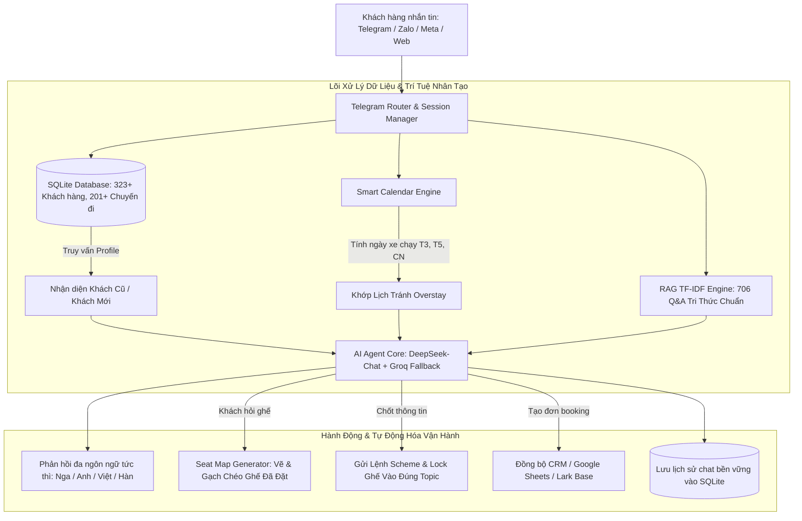

# 📘 TÀI LIỆU TOÀN DIỆN: QUY TRÌNH HOẠT ĐỘNG TỰ ĐỘNG CỦA AI CHATBOT EASY TRIP & VISA

> **Phiên bản**: 3.0 (Cập nhật bảng giá & nghiệp vụ điều hành chính thức)  
> **Áp dụng cho**: Toàn bộ hệ thống AI Chatbot, Nhân viên Điều hành & Tư vấn viên Easy Trip & Visa.

---

## 📑 MỤC LỤC
1. [Tổng Quan Kiến Trúc & Luồng Dữ Liệu](#1-tổng-quan-kiến-trúc--luồng-dữ-liệu)
2. [Quy Trình 5 Giai Đoạn Vận Hành Tự Động Của Bot](#2-quy-trình-5-giai-đoạn-vận-hành-tự-động-của-bot)
3. [Phân Định Chi Tiết: Khách Mới (New) vs Khách Cũ (Returning)](#3-phân-định-chi-tiết-khách-mới-vs-khách-cũ)
4. [Bảng Giá Bán Lẻ & Bảng Giá Ưu Đãi Khách Cũ](#4-bảng-giá-bán-lẻ--bảng-giá-ưu-đãi-khách-cũ)
5. [Quy Trình Lấy Sơ Đồ Xe & Cú Pháp Điều Hành Nhóm Telegram](#5-quy-trình-lấy-sơ-đồ-xe--cú-pháp-điều-hành-nhóm-telegram)
6. [Hệ Thống Tự Động Nhắc Nhở Hết Hạn Visa Trước 10 Ngày](#6-hệ-thống-tự-động-nhắc-nhở-hết-hạn-visa-trước-10-ngày)
7. [Hướng Dẫn Khởi Chạy & Giám Sát Hệ Thống 24/7](#7-hướng-dẫn-khởi-chạy--giám-sát-hệ-thống-247)

---

## 🏗️ 1. TỔNG QUAN KIẾN TRÚC & LUỒNG DỮ LIỆU



---

## 🔄 2. QUY TRÌNH 5 GIAI ĐOẠN VẬN HÀNH TỰ ĐỘNG CỦA BOT

### 📍 Giai đoạn 1: Tiếp Nhận Tin Nhắn & Nhận Diện Khách Hàng
1. **Phát tín hiệu "Đang soạn tin nhắn..." (Typing indicator)** ngay khi nhận tin nhắn để khách hàng an tâm.
2. **Quét cơ sở dữ liệu SQLite**:
   * Kiểm tra qua `telegram_id`, `phone_number`, `zalo_id` hoặc `facebook_id`.
   * **Nếu là Khách Mới**: Gán phân hạng `NEW`, chuẩn bị quy trình thu thập 5 thông tin.
   * **Nếu là Khách Cũ**: Tải toàn bộ hồ sơ (Họ tên, Quốc tịch, Ghế quen như `A1`, Điểm đón quen như `Oceanus Nha Trang`, Lịch sử đi).
3. **Phát hiện ngôn ngữ**: Tự động nhận diện chữ viết (Tiếng Nga, Tiếng Anh, Tiếng Việt, Tiếng Hàn, Tiếng Trung) để phản hồi chuẩn ngôn ngữ mẹ đẻ của khách.

---

### 📍 Giai đoạn 2: Thu Thập 5 Thông Tin & Tính Lịch Khởi Hành Tránh Overstay
Bot chủ động thu thập 5 thông tin cốt lõi:
1. **Quốc tịch**:
   * Nga, Belarus, Hàn Quốc, Malaysia, ASEAN... $\rightarrow$ Định tuyến **Lào (Cửa khẩu Bờ Y)** (Miễn visa Lào, tiết kiệm chi phí).
   * Mỹ, Anh, Canada, Úc, Châu Âu, Ấn Độ... $\rightarrow$ Định tuyến **Campuchia (Cửa khẩu Mộc Bài)**.
2. **Ngày hết hạn visa cũ**:
   * Bộ tính lịch tự động (`calculate_smart_departure`): Xe chạy đêm trước ngày hết hạn 1 ngày.
   * Ràng buộc lịch chạy xe: Tuyến Campuchia & Gói 90D Lào chỉ chạy tối **Thứ 3, Thứ 5, Chủ Nhật** $\rightarrow$ Tự động lùi về ngày xe chạy gần nhất để khách **tuyệt đối không bị phạt quá hạn visa (Overstay)**.
3. **Thành phố đón**: Nha Trang (Số 4 Trần Phú hoặc 40 Hòn Chồng) hoặc Đà Nẵng (Bến xe Trung tâm).
4. **Loại visa mong muốn**: Miễn thị thực 45 ngày (Free Visa) hay E-visa 90 ngày.
5. **Số điện thoại liên hệ (WhatsApp/Zalo/Telegram)**: Để nhà xe gửi số xe và tài xế gọi đón.

---

### 📍 Giai đoạn 3: Báo Giá Chuẩn & Gửi Ảnh Sơ Đồ Ghế Xe Trực Quan
1. **Áp dụng đúng bảng giá**:
   * Khách Mới $\rightarrow$ Báo đúng **Giá Bán Lẻ**.
   * Khách Cũ $\rightarrow$ Báo đúng **Bảng Giá Ưu Đãi Khách Cũ** (Giảm từ 100.000đ đến 1.300.000đ).
   * Đại lý $\rightarrow$ Báo giá chiết khấu đối tác (Sergei / Bolot / Arcenii).
2. **Tự động gửi ảnh sơ đồ ghế xe**:
   * Khi khách hỏi sơ đồ ghế hoặc chọn ghế: Module `seat_map_generator.py` tự động vẽ sơ đồ xe giường nằm 21 chỗ, đánh dấu **dấu gạch chéo vàng/xanh** vào các ghế đã có người đặt và gửi trực tiếp qua chat.

---

### 📍 Giai đoạn 4: Hướng Dẫn Nộp Hồ Sơ & Thông Tin Chuyển Khoản
1. **Tiêu chuẩn chụp ảnh hồ sơ làm E-visa**:
   * Ảnh trang thông tin hộ chiếu (Bio Page): Chụp thẳng góc vuông, thấy đủ 4 góc, rõ nét từng chữ, không bóng lóa và không dính ngón tay.
   * Ảnh chân dung: Nền sáng, rõ mặt, nhìn thẳng, không đeo kính.
2. **Thông tin tài khoản ngân hàng chính thức**:
   * **Ngân hàng**: Vietcombank (Ngân hàng TMCP Ngoại Thương Việt Nam)
   * **Tên tài khoản**: CÔNG TY TNHH EASY TRIP & VISA
   * **Số tài khoản**: **`1068582577`**
   * **Nội dung chuyển khoản**: `[Tên khách] [Ngày đi]`

---

### 📍 Giai đoạn 5: Tự Động Hóa Nghiệp Vụ Điều Hành & Đồng Bộ Dữ Liệu
1. **Tạo lệnh điều hành**: Tự sinh câu lệnh `Scheme` hoặc `Lock ghế` để gửi vào nhóm điều hành Telegram.
2. **Đồng bộ đơn hàng**: Tự động đẩy thông tin lên CRM (Lark Base / Google Sheet).
3. **Lưu trữ hội thoại**: Ghi nhận toàn bộ cuộc trò chuyện vào SQLite để duy trì trí nhớ cho các lần chat tiếp theo.

---

## 👥 3. PHÂN ĐỊNH CHI TIẾT: KHÁCH MỚI VS KHÁCH CŨ

| Tiêu chí so sánh | 👤 KHÁCH HÀNG MỚI (NEW) | 🌟 KHÁCH HÀNG CŨ (RETURNING) |
| :--- | :--- | :--- |
| **Nhận diện hệ thống** | Chưa có trong database, tạo mới với tier `NEW`. | Nhận diện tự động qua SĐT hoặc ID mạng xã hội, tier `RETURNING` hoặc `VIP`. |
| **Dữ liệu có sẵn** | Trống hoàn toàn. | Đã có: Họ tên, Quốc tịch, Ghế ưa thích (A1), Điểm đón (Oceanus), Số chuyến đã đi. |
| **Ngữ điệu giao tiếp** | Lịch sự, chu đáo, giới thiệu đầy đủ dịch vụ. | **Thân mật, ấm áp như người quen**, chào đúng tên, hỏi thăm chuyến đi trước. |
| **Thu thập thông tin** | Hỏi đầy đủ cả 5 thông tin từ đầu. | **Không hỏi lại quốc tịch và điểm đón**. Chỉ hỏi ngày hết hạn visa mới. |
| **Mức giá áp dụng** | **GIÁ BÁN LẺ (RETAIL)** | **GIÁ TRI ÂN KHÁCH CŨ (RETURNING)** |
| **Xử lý chỗ ngồi** | Gửi ảnh sơ đồ xe để khách tự chọn. | **Chủ động đề xuất giữ lại đúng vị trí ghế quen cũ** (ví dụ ghế A1 tầng dưới). |

---

## 💰 4. BẢNG GIÁ BÁN LẺ & BẢNG GIÁ ƯU ĐÃI KHÁCH CŨ

### 4.1. Dịch Vụ Xe Visarun Trọn Gói

| DỊCH VỤ | GIÁ BÁN LẺ (Khách Mới) | GIÁ ƯU ĐÃI (Khách Cũ) | ĐẠI LÝ SERGEI | ĐẠI LÝ BOLOT | ĐẠI LÝ ARCENII |
| :--- | :---: | :---: | :---: | :---: | :---: |
| **Free Visa Bờ Y (Lào 45D)** | **1.400.000đ** | **1.300.000đ** | 1.000.000đ | 1.050.000đ | 1.100.000đ |
| **Free Visa Mộc Bài (Cam 45D)** | **1.400.000đ** | **1.300.000đ** | 1.100.000đ | 1.150.000đ | 1.200.000đ |
| **Visarun 90D Lào (< 2 ngày)** | **4.000.000đ** | **3.550.000đ** | 2.520.000đ | 2.650.000đ | 2.800.000đ |
| **Visarun 90D Lào (> 3 ngày)** | **2.450.000đ** | - | - | - | - |
| **Visarun 90D Cam (< 2 ngày)** | **4.000.000đ** | **3.550.000đ** | 2.520.000đ | 2.650.000đ | 2.800.000đ |
| **Visarun 90D Cam (> 3 ngày)** | **2.450.000đ** | - | - | - | - |
| **Visarun Nga 4h (Single)** | **3.400.000đ** | **3.400.000đ** | - | - | - |
| **Visarun Nga 4h (Multi)** | **4.400.000đ** | **4.400.000đ** | - | - | - |

---

### 4.2. Dịch Vụ Làm E-Visa Lẻ (Single Entry)

| GÓI THỜI GIAN | GIÁ BÁN LẺ (Khách Mới) | GIÁ ƯU ĐÃI (Khách Cũ) | ĐẠI LÝ SERGEI | ĐẠI LÝ BOLOT | ĐẠI LÝ ARCENII |
| :--- | :---: | :---: | :---: | :---: | :---: |
| **Siêu khẩn 1 giờ** | **4.600.000đ** | **3.300.000đ** | 3.300.000đ | 3.300.000đ | 3.300.000đ |
| **Khẩn 2 giờ** | **3.400.000đ** | **2.900.000đ** | 2.700.000đ | 2.700.000đ | 2.900.000đ |
| **Khẩn 4 giờ (< 2 ngày)** | **2.600.000đ** | **1.600.000đ** | 1.420.000đ | 1.500.000đ | 1.600.000đ |
| **Khẩn 4 giờ (> 3 ngày)** | **2.600.000đ** | **1.600.000đ** | 1.350.000đ | 1.500.000đ | 1.600.000đ |
| **Gấp 8 giờ** | **2.900.000đ** | **1.900.000đ** | 1.650.000đ | 1.800.000đ | 1.900.000đ |
| **Gấp 1 ngày** | **2.200.000đ** | **1.500.000đ** | 1.350.000đ | 1.350.000đ | 1.500.000đ |
| **Gấp 2 ngày** | **2.150.000đ** | **1.450.000đ** | 1.300.000đ | 1.300.000đ | 1.450.000đ |
| **Tiêu chuẩn 3 - 5 ngày** | **1.810.000đ** | **1.110.000đ** | 1.050.000đ | 1.050.000đ | 1.110.000đ |
| **E-visa Multi-entry** | **+ 1.000.000đ** vào gói Single tương ứng |

---

### 4.3. Tuyến Đà Nẵng & Dịch Vụ Fast Track Sân Bay

| DỊCH VỤ | GIÁ BÁN LẺ (Khách Mới) | KHÁCH CŨ / ĐẠI LÝ | ĐẠI LÝ SERGEI |
| :--- | :---: | :---: | :---: |
| **Xe buýt Đà Nẵng - Lao Bảo** | **950.000đ** | - | - |
| **Visarun ĐN - Lao Bảo (trước 3 ngày)** | **3.550.000đ** | - | **2.800.000đ** |
| **Visarun ĐN - Lao Bảo (khẩn)** | **3.800.000đ** | - | **3.050.000đ** |
| **Fast track Đón Cam Ranh / Đà Nẵng** | **1.200.000đ** | **540.000đ** | **450.000đ** |
| **Fast track Đón Tân Sơn Nhất / Nội Bài** | **1.200.000đ** | **675.000đ** | **675.000đ** |
| **Fast track Tiễn Tân Sơn Nhất** | **1.890.000đ** | **891.000đ** | **891.000đ** |
| **Fast track Tiễn Sân bay khác** | **1.890.000đ** | **756.000đ** | **756.000đ** |
| **Fast track Tiễn Cam Ranh VIP** | **1.890.000đ** | **1.890.000đ** | **1.890.000đ** |

---

## 🚌 5. QUY TRÌNH LẤY SƠ ĐỒ XE & CÚ PHÁP ĐIỀU HÀNH NHÓM TELEGRAM

### 5.1. Cấu Trúc Topic Trong Nhóm `EasyTrip booking BUS`
* **`# General`**: Kênh điều phối chung, dùng để gửi lệnh xin sơ đồ xe (`Scheme`).
* **Topic `[Ngày/Tháng] - 45D`**: Topic riêng cho các chuyến xe 45 ngày Lào *(Ví dụ: `11/10 - 45D`, `8/9 - 45D`)*.
* **Topic `[Ngày/Tháng] - 90D`**: Topic riêng cho các chuyến xe 90 ngày Lào *(Ví dụ: `10/9 - 90D`, `3/9 - 90D`)*.
* **Topic `[Ngày/Tháng] - mộc bài`** *(hoặc `mbi`)*: Topic riêng cho tuyến Campuchia *(Ví dụ: `13/9 - mbi`, `3/9 - mộc bài`)*.

---

### 5.2. Cú Pháp Câu Lệnh Xin Sơ Đồ Xe (`Scheme`)

* 🇰🇭 **Tuyến Campuchia (Mộc Bài)**:
  ```text
  Scheme 13/09- mộc bài
  ```
* 🇱🇦 **Tuyến Lào 90 Ngày**:
  ```text
  Scheme 10/09 - 90D Laos
  ```
* 🇱🇦 **Tuyến Lào 45 Ngày**:
  ```text
  11/10 45d Laos
  ```
  hoặc:
  ```text
  Scheme 11/10 - 45D
  ```

---

### 5.3. Cách Lấy Sơ Đồ Xe Từ Topic Gửi Cho Khách
1. Mở đúng **Topic ngày xe khởi hành** ở cột bên trái *(Ví dụ topic `11/10 - 45D`)*.
2. Tải ảnh sơ đồ xe giường nằm 21 chỗ mới nhất do nhà xe vừa gửi trong topic.
3. **Cách đọc sơ đồ ghế**:
   * 🟡 **Ghế có vạch gạch vàng / dấu X xanh** *(như B1, A3, B3, A5, B5, A11)*: **ĐÃ CÓ NGƯỜI ĐẶT**.
   * ⚪ **Ghế còn nguyên số** *(như A1, A7, B7, A9, B9, A2, B2, A4, B4, A6, B6, A8, B8, A10, B10, A12)*: **CÒN TRỐNG**.
4. Gửi ảnh sơ đồ này cho khách để khách chọn chỗ nằm mong muốn.

---

### 5.4. Cú Pháp Khóa Ghế & Báo Khách Vào Đúng Topic
> ⚠️ **Quy tắc bắt buộc**: Gửi trực tiếp vào **ĐÚNG TOPIC NGÀY XE**, không gửi vào `# General` để tránh nhà xe hủy nhầm ghế.

* **Cú pháp 1: Khóa ghế tạm thời (Chờ khách thanh toán)**:
  ```text
  Lock A9 A10 Telegram
  ```
* **Cú pháp 2: Báo khách chính thức & Đã thanh toán**:
  ```text
  [HỌ TÊN KHÁCH]/[NĂM SINH] [SỐ GHẾ] [NGUỒN] [ĐIỂM ĐÓN] [TÌNH TRẠNG TT]
  ```
  *Ví dụ thực tế:*
  ```text
  DRAPPIER ALEXANDRE GERARD GILBERT/2002 A12 ZALO Hòn Chồng Đã tt
  ```

---

## ⏰ 6. HỆ THỐNG TỰ ĐỘNG NHẮC NHỞ HẾT HẠN VISA TRƯỚC 10 NGÀY

1. **Thời điểm quét**: Chạy ngầm tự động lúc **09:00 sáng hàng ngày**.
2. **Cơ chế quét**: Lọc tất cả khách cũ có `visa_expiry_date` trong khoảng **9 đến 11 ngày tới**.
3. **Cá nhân hóa theo ngôn ngữ & thói quen**:
   * **Khách Nga (`ru`)**: Nhắc ngày hết hạn, đề xuất giữ chỗ quen `A1` và đón tại `Oceanus Nha Trang`.
   * **Khách Hàn (`ko`)**: Soạn tin kính ngữ, đề xuất ghế `B2`.
   * **Khách Quốc Tế (`en`)**: Soạn tin tiếng Anh thân thiện, nhắc đón tại `4 Trần Phú`.
   * **Khách Việt (`vi`) & Khách Pháp (`fr`)**.
4. **Cơ chế chống spam**: Mỗi khách chỉ nhận 1 tin nhắn nhắc nhở trong 7 ngày.
5. **Nối tiếp hội thoại thông minh**: Khi khách phản hồi, AI Agent tự động hiểu ngữ cảnh và chốt chuyến tiếp theo với **Bảng Giá Ưu Đãi Khách Cũ**.

---

## 🚀 7. HƯỚNG DẪN KHỞI CHẠY & GIÁM SÁT HỆ THỐNG 24/7

### 7.1. Lệnh Khởi Chạy Hệ Thống

```bash
# 1. Khởi chạy Backend FastAPI Server (Cổng 8000)
./venv/bin/uvicorn main:app --host 0.0.0.0 --port 8000

# 2. Khởi chạy Telegram Bot Poller (Lắng nghe @Easy_Trip_Visa_bot)
./venv/bin/python telegram_poller.py
```

### 7.2. Các Kênh Theo Dõi & Giám Sát
* **Trang Live Chat Studio (Co-Pilot)**: `http://localhost:8000/copilot/index.html` (Xem tin nhắn thực tế, duyệt tin nhắn nháp hoặc can thiệp chat thủ công).
* **Trang Nhật Ký Tin Nhắn (Admin Logs)**: `http://localhost:8000/admin/logs`.
* **Cơ sở dữ liệu SQLite**: `easytrip_chat.db` (Lưu trữ toàn bộ hồ sơ khách hàng, chuyến đi và lịch sử chat).

---
*Tài liệu nội bộ thuộc bản quyền Easy Trip & Visa Co. Ltd.*
