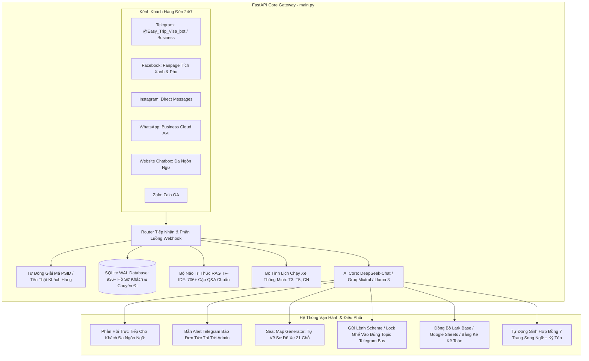
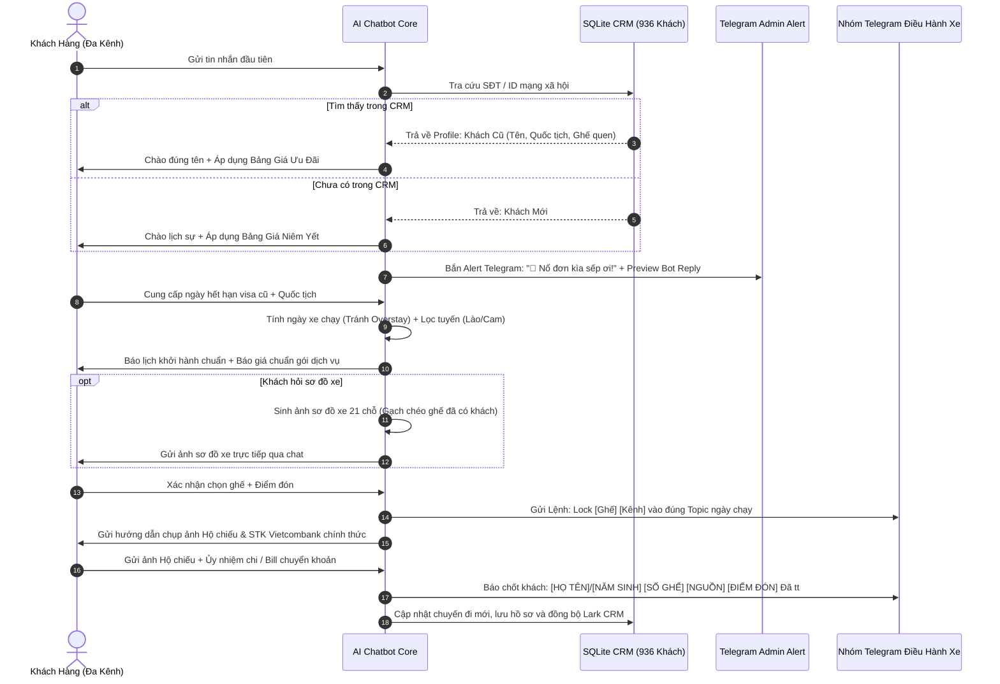
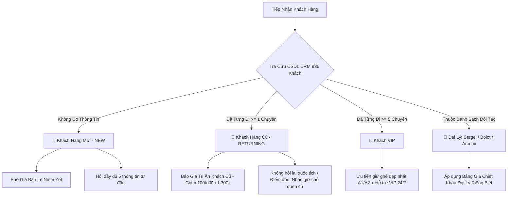

# 📘 QUY TRÌNH HOẠT ĐỘNG TOÀN DIỆN VẬN HÀNH AI CHATBOT EASY TRIP & VISA

> **Phiên bản**: 4.0 (Nâng cấp Hệ Thống Đa Kênh Toàn Diện, Thông Báo Admin Thời Gian Thực & Tự Động Hóa Vận Hành)  
> **Áp dụng cho**: Toàn bộ hệ thống AI Chatbot, Nhân viên Điều hành, CSKH & Quản trị viên Easy Trip & Visa.

---

## 📑 MỤC LỤC
1. [Kiến Trúc Đa Kênh Toàn Diện & Luồng Xử Lý (Omnichannel Flow)](#1-kiến-trúc-đa-kênh-toàn-diện--luồng-xử-lý-omnichannel-flow)
2. [Cơ Chế Báo Đơn Tức Thì & Giám Sát Admin Real-time (Telegram Alert)](#2-cơ-chế-báo-đơn-tức-thì--giám-sát-admin-real-time-telegram-alert)
3. [Hai Chế Độ Vận Hành: Tự Động (Auto Mode) & Bán Tự Động (Co-Pilot Mode)](#3-hai-chế-độ-vận-hành-tự-động-auto-mode--bán-tự-động-co-pilot-mode)
4. [Quy Trình 5 Giai Đoạn Phục Vụ Khách Hàng Khép Kín](#4-quy-trình-5-giai-đoạn-phục-vụ-khách-hàng-khép-kín)
5. [Phân Định Khách Hàng: Mới (New), Cũ (Returning), VIP & Đại Lý](#5-phân-định-khách-hàng-mới-new-cũ-returning-vip--đại-lý)
6. [Bảng Giá Bán Lẻ & Bảng Giá Ưu Đãi Khách Cũ / Đại Lý](#6-bảng-giá-bán-lẻ--bảng-giá-ưu-đãi-khách-cũ--đại-lý)
7. [Thuật Toán Lịch Xe Tránh Quá Hạn Visa (Anti-Overstay Scheduling)](#7-thuật-toán-lịch-xe-tránh-quá-hạn-visa-anti-overstay-scheduling)
8. [Quy Trình Sơ Đồ Xe Tự Động & Lệnh Điều Hành Nhóm Telegram](#8-quy-trình-sơ-đồ-xe-tự-động--lệnh-điều-hành-nhóm-telegram)
9. [Hệ Thống Tự Động Quét & Nhắc Hết Hạn Visa Trước 10 Ngày](#9-hệ-thống-tự-động-quét--nhắc-hết-hạn-visa-trước-10-ngày)
10. [Tự Động Hóa Tạo Hợp Đồng Song Ngữ (7 Trang) & Kế Toán CRM](#10-tự-động-hóa-tạo-hợp-đồng-song-ngữ-7-trang--kế-toán-crm)
11. [Hướng Dẫn Triển Khai, Khởi Chạy & Bảo Mật Webhook](#11-hướng-dẫn-triển-khai-khởi-chạy--bảo-mật-webhook)

---

## 🏗️ 1. KIẾN TRÚC ĐA KÊNH TOÀN DIỆN & LUỒNG XỬ LÝ (OMNICHANNEL FLOW)

Hệ thống kết nối đa nền tảng qua Backend FastAPI tập trung, tích hợp bộ nhớ bền vững SQLite (WAL Mode), RAG TF-IDF, và các mô hình AI LLM (DeepSeek / Groq Fallback).



### Các Kênh Tích Hợp Chi Tiết:
1. **Telegram (@Easy_Trip_Visa_bot)**: Xử lý chat cá nhân, tiếp nhận lệnh `/start`, khảo sát khách cũ, chọn ghế, nhận ảnh hồ sơ hộ chiếu.
2. **Meta Facebook Messenger**: Tiếp nhận qua Webhook Graph API, tích hợp tự động phân giải PSID ra tên thật qua Page Conversations API.
3. **Instagram Direct Messaging**: Tiếp nhận webhook nhắn tin từ khách quốc tế trên Instagram.
4. **WhatsApp Business Cloud API**: Tiếp nhận tin nhắn qua số điện thoại quốc tế (+84, +7, +1, +44...).
5. **Website Live Chat / Co-Pilot Studio**: Web client tương tác thời gian thực, hỗ trợ chế độ Co-Pilot duyệt tin nhắn nháp.
6. **Zalo OA**: Đồng bộ khách hàng qua kênh Zalo chính thức.

---

## 🔔 2. CƠ CHẾ BÁO ĐƠN TỨC THÌ & GIÁM SÁT ADMIN REAL-TIME (TELEGRAM ALERT)

Mỗi khi có khách hàng gửi tin nhắn từ bất kỳ kênh nào, hàm `notify_admin_incoming_message` lập tức gửi thông báo đẩy trực tiếp tới Telegram Admin (`ADMIN_TELEGRAM_ID`) hoặc Nhóm Quản Trị (`ADMIN_GROUP_CHAT_ID`).

### 2.1. Cấu Trúc Thông Báo Admin:
* **Tiêu đề cảm xúc, thân thiện**:
  - `🚀 Nổ đơn kìa sếp ơi!`
  - `💃 Khách iu ghé thăm!`
  - `🔥 Có khách cần chốt visa kìa sếp!`
  - `✨ Khách quen quay lại!`
* **Thông tin định danh khách**:
  - Tên hiển thị / Tên thật (Nếu tra cứu được từ CRM).
  - Kênh tiếp nhận: `Facebook (Fanpage Tích Xanh)`, `WhatsApp Business`, `Telegram`, `Website`, `Instagram`.
  - Quốc tịch & Số điện thoại (nếu có trong hồ sơ).
* **Nội dung cuộc hội thoại**:
  - 💬 **Khách nhắn**: Trích xuất chính xác câu hỏi/yêu cầu của khách.
  - 🤖 **Bot đã phản hồi**: Hiển thị câu trả lời mà Bot đã gửi cho khách (ở chế độ Auto) hoặc câu trả lời nháp (ở chế độ Co-Pilot).
* **Nút hành động nhanh (Inline Buttons)**:
  - 🖥️ `Mở Co-Pilot Studio` (Truy cập nhanh bàn làm việc điều hành).
  - ✍️ `Can thiệp trả lời / Tiếp quản chat`.

---

## ⚙️ 3. HAI CHẾ ĐỘ VẬN HÀNH: TỰ ĐỘNG (AUTO MODE) & BÁN TỰ ĐỘNG (CO-PILOT MODE)

| Đặc Điểm | 🤖 TỰ ĐỘNG (AUTO MODE - Mặc Định) | 🧑‍💻 BÁN TỰ ĐỘNG (CO-PILOT / HUMAN MODE) |
| :--- | :--- | :--- |
| **Mục đích** | Phản hồi siêu tốc 24/7, không để khách chờ dù chỉ 1 giây. | Áp dụng khi đào tạo nhân viên mới, thử nghiệm kịch bản giá mới hoặc kiểm soát 100% nội dung. |
| **Hành vi Bot** | AI tự động phân tích và gửi ngay câu trả lời cho khách. | AI soạn bản nháp (Draft Reply) kèm độ tự tin (Confidence %). |
| **Vai trò Admin** | Nhận thông báo giám sát qua Telegram; can thiệp khi cần. | Bấm **Duyệt & Gửi (Approve)** hoặc **Sửa & Dạy Bot (Edit & Teach)** trên Co-Pilot Studio. |
| **Tự học (Active Learning)**| Ghi nhận lịch sử hội thoại để cải thiện RAG. | Khi Admin sửa câu trả lời, Bot lập tức nạp tri thức mới vào bộ nhớ tức thì. |

---

## 🔄 4. QUY TRÌNH 5 GIAI ĐOẠN PHỤC VỤ KHÁCH HÀNG KHÉP KÍN



---

## 👥 5. PHÂN ĐỊNH KHÁCH HÀNG: MỚI (NEW), CŨ (RETURNING), VIP & ĐẠI LÝ



---

## 💰 6. BẢNG GIÁ BÁN LẺ & BẢNG GIÁ ƯU ĐÃI KHÁCH CŨ / ĐẠI LÝ

### 6.1. Dịch Vụ Xe Visarun Trọn Gói

| DỊCH VỤ | GIÁ BÁN LẺ (Khách Mới) | GIÁ ƯU ĐÃI (Khách Cũ) | ĐẠI LÝ SERGEI | ĐẠI LÝ BOLOT | ĐẠI LÝ ARCENII |
| :--- | :---: | :---: | :---: | :---: | :---: |
| **Free Visa Bờ Y (Lào 45D)** | **1.400.000đ** | **1.300.000đ** | 1.000.000đ | 1.050.000đ | 1.100.000đ |
| **Free Visa Mộc Bài (Cam 45D)** | **1.400.000đ** | **1.300.000đ** | 1.100.000đ | 1.150.000đ | 1.200.000đ |
| **Visarun 90D Lào (< 2 ngày)** | **4.000.000đ** | **3.550.000đ** | 2.520.000đ | 2.650.000đ | 2.800.000đ |
| **Visarun 90D Lào (> 3 ngày)** | **2.450.000đ** | - | - | - | - |
| **Visarun 90D Cam (< 2 ngày)** | **4.000.000đ** | **3.550.000đ** | 2.520.000đ | 2.650.000đ | 2.800.000đ |
| **Visarun 90D Cam (> 3 ngày)** | **2.450.000đ** | - | - | - | - |
| **Visarun Nga 4h (Single)** | **3.400.000đ** | **3.000.000đ** | - | - | - |
| **Visarun Nga 4h (Multi)** | **4.400.000đ** | **4.000.000đ** | - | - | - |

---

### 6.2. Dịch Vụ Làm E-Visa Lẻ (Single Entry)

| GÓI THỜI GIAN | GIÁ BÁN LẺ (Khách Mới) | GIÁ ƯU ĐÃI (Khách Cũ) | ĐẠI LÝ SERGEI | ĐẠI LÝ BOLOT | ĐẠI LÝ ARCENII |
| :--- | :---: | :---: | :---: | :---: | :---: |
| **Siêu khẩn 1 giờ** | **4.600.000đ** | **3.300.000đ** | 3.300.000đ | 3.300.000đ | 3.300.000đ |
| **Khẩn 2 giờ** | **3.400.000đ** | **2.900.000đ** | 2.700.000đ | 2.700.000đ | 2.900.000đ |
| **Khẩn 4 giờ (< 2 ngày)** | **2.600.000đ** | **1.600.000đ** | 1.420.000đ | 1.500.000đ | 1.600.000đ |
| **Khẩn 4 giờ (> 3 ngày)** | **2.600.000đ** | **1.600.000đ** | 1.350.000đ | 1.500.000đ | 1.600.000đ |
| **Gấp 8 giờ** | **2.900.000đ** | **1.900.000đ** | 1.650.000đ | 1.800.000đ | 1.900.000đ |
| **Gấp 1 ngày** | **2.200.000đ** | **1.500.000đ** | 1.350.000đ | 1.350.000đ | 1.500.000đ |
| **Gấp 2 ngày** | **2.150.000đ** | **1.450.000đ** | 1.300.000đ | 1.300.000đ | 1.450.000đ |
| **Tiêu chuẩn 3 - 5 ngày** | **1.810.000đ** | **1.110.000đ** | 1.050.000đ | 1.050.000đ | 1.110.000đ |
| **E-visa Multi-entry** | **+ 1.000.000đ** vào gói Single tương ứng |

---

### 6.3. Tuyến Đà Nẵng & Fast Track Sân Bay

| DỊCH VỤ | GIÁ BÁN LẺ (Khách Mới) | KHÁCH CŨ / ĐẠI LÝ | ĐẠI LÝ SERGEI |
| :--- | :---: | :---: | :---: |
| **Xe buýt Đà Nẵng - Lao Bảo** | **950.000đ** | - | - |
| **Visarun ĐN - Lao Bảo (trước 3 ngày)** | **3.550.000đ** | - | **2.800.000đ** |
| **Visarun ĐN - Lao Bảo (khẩn)** | **3.800.000đ** | - | **3.050.000đ** |
| **Fast track Đón Cam Ranh / Đà Nẵng** | **1.200.000đ** | **540.000đ** | **450.000đ** |
| **Fast track Đón Tân Sơn Nhất / Nội Bài** | **1.200.000đ** | **675.000đ** | **675.000đ** |
| **Fast track Tiễn Tân Sơn Nhất** | **1.890.000đ** | **891.000đ** | **891.000đ** |
| **Fast track Tiễn Sân bay khác** | **1.890.000đ** | **756.000đ** | **756.000đ** |
| **Fast track Tiễn Cam Ranh VIP** | **1.890.000đ** | **1.890.000đ** | **1.890.000đ** |

---

## 📅 7. THUẬT TOÁN LỊCH XE TRÁNH QUÁ HẠN VISA (ANTI-OVERSTAY SCHEDULING)

Bộ tính toán lịch (`calculate_smart_departure` & `validate_and_adjust_departure`) hoạt động theo nguyên lý nghiêm ngặt:

1. **Tuyến Lào 45 Ngày (Từ Nha Trang)**:
   - Xe chạy **MỖI NGÀY** vào ban đêm (19h00 - 20h00).
   - Ngày khởi hành chuẩn: $T_{depart} = T_{expiry} - 1 \text{ ngày}$.
2. **Tuyến Lào 90 Ngày & Tuyến Campuchia (Mộc Bài)**:
   - Xe chỉ chạy cố định vào các tối: **Thứ 3, Thứ 5, Chủ Nhật**.
   - Thuật toán tự động tìm ngày chạy xe gần nhất nằm **trước hoặc bằng** $T_{expiry} - 1 \text{ ngày}$.
   - *Ví dụ*: Visa hết hạn vào Thứ 5 ngày 15/09 $\rightarrow$ Ngày muộn nhất được đi là Thứ 4 ngày 14/09. Do Thứ 4 không có xe chạy, hệ thống **tự động lùi về Thứ 3 ngày 13/09** và giải thích rõ ràng cho khách để tránh rủi ro phạt overstay tại cửa khẩu.

---

## 🚌 8. QUY TRÌNH SƠ ĐỒ XE TỰ ĐỘNG & LỆNH ĐIỀU HÀNH NHÓM TELEGRAM

### 8.1. Sơ Đồ Ghế Xe Tự Động (Seat Map Generator)
- Xe giường nằm cao cấp 21 chỗ gồm 2 dãy A và B (A1-A12, B1-B10).
- Module `seat_map_generator.py` tự động lấy danh sách ghế đã đặt từ CSDL, gạch chéo vàng/xanh vào các vị trí đã khóa và gửi ảnh nét cao trực tiếp vào cuộc chat của khách.

### 8.2. Cấu Trúc Topic Trong Nhóm Điều Hành `EasyTrip booking BUS`:
* `# General`: Kênh điều phối chung, dùng để phát lệnh xin sơ đồ xe (`Scheme`).
* Topic `[Ngày/Tháng] - 45D`: Chuyến xe 45 ngày Lào *(Ví dụ: `11/10 - 45D`)*.
* Topic `[Ngày/Tháng] - 90D`: Chuyến xe 90 ngày Lào *(Ví dụ: `10/09 - 90D`)*.
* Topic `[Ngày/Tháng] - mộc bài` *(hoặc `mbi`)*: Chuyến Campuchia *(Ví dụ: `13/09 - mbi`)*.

### 8.3. Cú Pháp Câu Lệnh Điều Hành:
* **Xin sơ đồ xe (Gửi vào `# General`)**:
  ```text
  Scheme 13/09- mộc bài
  Scheme 10/09 - 90D Laos
  Scheme 11/10 - 45D
  ```
* **Khóa ghế tạm thời (Gửi vào đúng Topic ngày xe)**:
  ```text
  Lock A9 A10 Telegram
  Lock B1 Facebook
  ```
* **Báo khách chính thức & Đã thanh toán (Gửi vào đúng Topic ngày xe)**:
  ```text
  [HỌ TÊN KHÁCH]/[NĂM SINH] [SỐ GHẾ] [NGUỒN] [ĐIỂM ĐÓN] [TÌNH TRẠNG TT]
  ```
  *Ví dụ chuẩn:*
  ```text
  DRAPPIER ALEXANDRE GERARD GILBERT/2002 A12 ZALO Hòn Chồng Đã tt
  IVANOV SERGEI/1990 A1 TELEGRAM 4 Trần Phú Đã tt
  ```

---

## ⏰ 9. HỆ THỐNG TỰ ĐỘNG QUÉT & NHẮC HẾT HẠN VISA TRƯỚC 10 NGÀY

1. **Lịch trình tự động**: Cronjob nội bộ kích hoạt lúc **09:00 sáng hàng ngày** (`visa_reminder.py`).
2. **Tiêu chí lọc hồ sơ**:
   - Khách hàng có `visa_expiry_date` cách ngày hiện tại từ **9 đến 11 ngày**.
   - Trạng thái `reminder_status` chưa gửi hoặc đã qua hơn 7 ngày (Cơ chế chống spam nghiêm ngặt).
3. **Mẫu tin nhắn cá nhân hóa theo ngôn ngữ mẹ đẻ**:
   - 🇷🇺 **Tiếng Nga (`ru`)**: Chào thân mật theo tên, nhắc visa sắp hết hạn, chủ động đề xuất giữ lại ghế quen `A1` và điểm đón quen `Oceanus Nha Trang`.
   - 🇰🇷 **Tiếng Hàn (`ko`)**: Sử dụng kính ngữ trang trọng, đề xuất giữ chỗ quen `B2`.
   - 🇬🇧 **Tiếng Anh (`en`)**: Lịch sự, chuyên nghiệp, thông báo lịch xe chạy gần nhất.
   - 🇻🇳 **Tiếng Việt (`vi`)** & 🇫🇷 **Tiếng Pháp (`fr`)**.
4. **Xử lý phản hồi**: Khi khách trả lời tin nhắn nhắc nhở, Bot tự động nối tiếp ngữ cảnh, áp dụng ngay **Bảng Giá Ưu Đãi Khách Cũ** để chốt chuyến tiếp theo.

---

## 📑 10. TỰ ĐỘNG HÓA TẠO HỢP ĐỒNG SONG NGỮ (7 TRANG) & KẾ TOÁN CRM

1. **Quy chuẩn hợp đồng**: Hợp đồng dịch vụ tư vấn visa song ngữ Việt - Anh chuẩn 7 trang (`generate_contracts.py`).
2. **Bóc tách chữ ký tự động**: Tự động nhận diện vùng chữ ký trên ảnh Hộ chiếu, tách nền trong suốt và chèn vào đúng vị trí chữ ký của Khách Hàng (Bên B).
3. **Phân loại hạch toán Khách Lẻ vs Đại Lý**:
   - **Khách lẻ**: Chi phí = 0đ (không chi trả trung gian), Doanh thu = Giá thu khách.
   - **Đại lý**: Tự động trích xuất hoa hồng/chi phí trung gian theo biểu phí đại lý (Sergei, Bolot, Arcenii).
4. **Đối soát kế toán**: Xuất file Excel bảng kê 17 cột chuẩn mực, phục vụ công tác kế toán và kiểm toán thuế.

---

## 🚀 11. HƯỚNG DẪN TRIỂN KHAI, KHỞI CHẠY & BẢO MẬT WEBHOOK

### 11.1. Lệnh Khởi Chạy Hệ Thống

```bash
# 1. Kích hoạt môi trường ảo Python
source venv/bin/activate  # Trên Linux/macOS
# hoặc venv\Scripts\activate trên Windows

# 2. Khởi chạy Server FastAPI Gateway (Cổng 8000)
python main.py
# hoặc uvicorn main:app --host 0.0.0.0 --port 8000 --reload

# 3. Khởi chạy Telegram Bot Poller dự phòng (Nếu không dùng Webhook trực tiếp)
python telegram_poller.py
```

### 11.2. Cơ Chế Webhook Guardian Tự Động Phục Hồi
Backend tích hợp tiến trình nền `webhook_guardian()` chạy ngầm mỗi 60 giây. Nếu Webhook URL của Telegram bị sai lệch hoặc mất kết nối với Render Server (`RENDER_EXTERNAL_URL`), hệ thống sẽ tự động khôi phục Webhook ngay lập tức mà không cần can thiệp thủ công.

### 11.3. Bảng Điều Khiển & Giám Sát
* **Trang Co-Pilot Studio (Live Chat)**: `http://localhost:8000/copilot/index.html`
* **Trang Nhật Ký Tin Nhắn Admin**: `http://localhost:8000/admin/logs`
* **File Cơ Sở Dữ Liệu SQLite**: `easytrip_chat.db`

---

*Tài liệu quy trình vận hành chính thức thuộc bản quyền Easy Trip & Visa Co. Ltd. Mọi cập nhật cần được đồng bộ trực tiếp lên hệ thống GitHub và CSDL trung tâm.*
