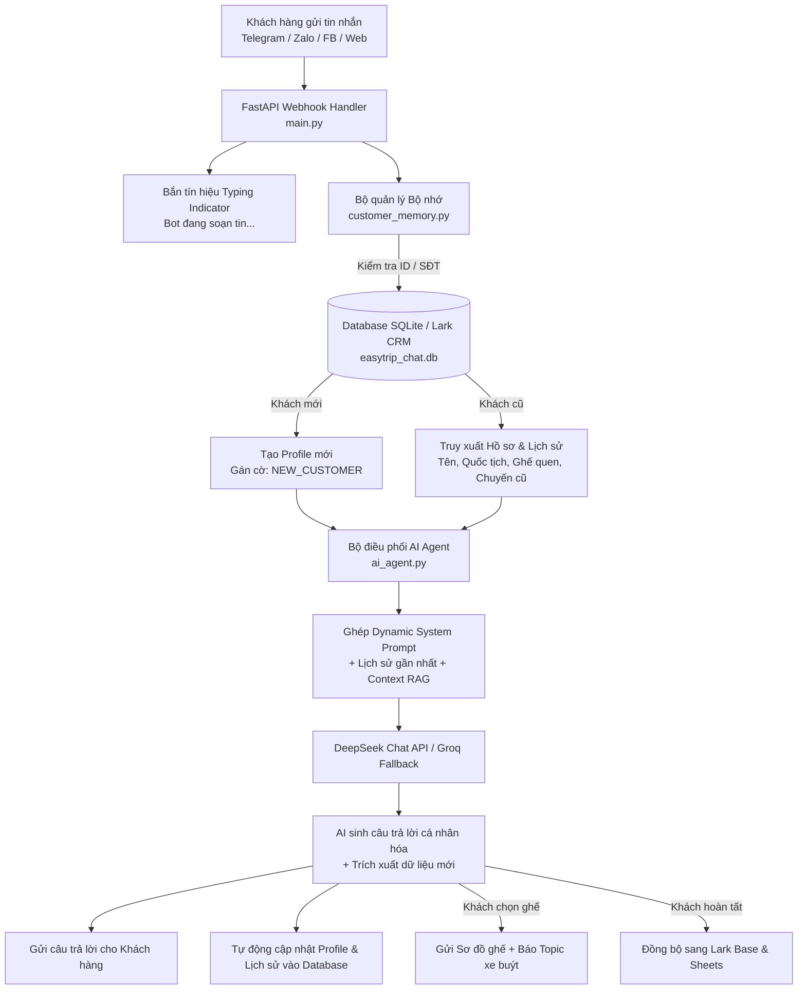
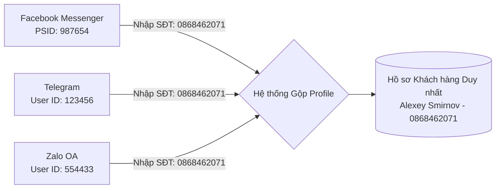

# QUY TRÌNH TOÀN DIỆN: NÂNG CẤP BỘ NHỚ DÀI HẠN & TỐI ƯU HÓA CHATBOT EASYTRIP

> **Tài liệu Kỹ thuật & Hướng dẫn Vận hành**  
> **Dự án:** Easy Trip & Visa Omnichannel AI Chatbot  
> **Phiên bản nâng cấp:** 2.0 (Long-Term Memory, Returning Customer Recognition & Tone Adaptation)  
> **Mục tiêu:** Giúp Chatbot tự động nhận diện khách hàng cũ, truy xuất lịch sử, nhớ sở thích/thông tin cá nhân và tự động điều chỉnh ngữ điệu trò chuyện tự nhiên, thân mật nhất.

---

## MỤC LỤC

1. [Tổng quan & Mục tiêu Nâng cấp](#1-tổng-quan--mục-tiêu-nâng-cấp)
2. [Kiến trúc Hệ thống Mới (System Architecture)](#2-kiến-trúc-hệ-thống-mới-system-architecture)
3. [Thiết kế Cơ sở Dữ liệu Bộ nhớ (Database Schema)](#3-thiết-kế-cơ-sở-dữ-liệu-bộ-nhớ-database-schema)
4. [Quy trình Xử lý Nhận diện Khách Cũ (Workflow Chi tiết)](#4-quy-trình-xử-lý-nhận-diện-khách-cũ-workflow-chi-tiết)
5. [Thiết kế Prompt & Cá nhân hóa Ngữ điệu (Dynamic Prompting)](#5-thiết-kế-prompt--cá-nhân-hóa-ngữ-điệu-dynamic-prompting)
6. [Cơ chế Đồng bộ Định danh Đa kênh (Cross-Platform Resolution)](#6-cơ-chế-đồng-bộ-định-danh-đa-kênh-cross-platform-resolution)
7. [Tối ưu hóa Hiệu năng & Trải nghiệm Người dùng](#7-tối-ưu-hóa-hiệu-năng--trải-nghiệm-người-dùng)
8. [Lộ trình Triển khai Mã nguồn (File-by-File Implementation)](#8-lộ-trình-triển-khai-mã-nguồn-file-by-file-implementation)
9. [Kịch bản Kiểm thử & Tiêu chuẩn Nghiệm thu (Test Cases)](#9-kịch-bản-kiểm-thử--tiêu-chuẩn-nghiệm-thu-test-cases)

---

## 1. TỔNG QUAN & MỤC TIÊU NÂNG CẤP

### 1.1. Hiện trạng trước nâng cấp
* Dữ liệu hội thoại lưu tạm trong RAM (`memory_store = {}`). Khi server khởi động lại hoặc sau một thời gian, toàn bộ phiên chat bị xóa.
* Bot chỉ đọc 8 tin nhắn gần nhất trong phiên hiện tại, coi mọi khách hàng quay lại đều là khách mới hoàn toàn.
* Khách quen phải trả lời lại các câu hỏi cơ bản (Quốc tịch, Tên, Điểm đón, Loại visa).

### 1.2. Mục tiêu sau nâng cấp
* **Nhận diện khách cũ 100%**: Nhận biết ngay khách hàng quay lại qua Telegram ID, Zalo ID, Facebook ID hoặc Số điện thoại.
* **Bộ nhớ bền vững (Persistent Memory)**: Lưu trữ lịch sử các chuyến đi cũ, vị trí ghế ưa thích, thói quen thanh toán, điểm đón quen thuộc.
* **Cá nhân hóa ngữ điệu (Dynamic Tone)**:
  * *Khách mới*: Chào đón chuẩn mực, tư vấn chuyên nghiệp, thu thập thông tin nhẹ nhàng.
  * *Khách cũ*: Chào mừng nồng nhiệt như người quen gặp lại, xưng hô đúng tên, hỏi thăm chuyến đi trước, không hỏi lại quốc tịch, chủ động gợi ý lịch trình phù hợp với hạn visa mới.
* **Tăng tốc phản hồi**: Thêm hiệu ứng gõ phím (*Typing Indicator*) tức thì, giảm tỷ lệ khách thoát cuộc trò chuyện.

---

## 2. KIẾN TRÚC HỆ THỐNG MỚI (SYSTEM ARCHITECTURE)



---

## 3. THIẾT KẾ CƠ SỞ DỮ LIỆU BỘ NHỚ (DATABASE SCHEMA)

Sử dụng cơ sở dữ liệu **SQLite** (`easytrip_chat.db`) gọn nhẹ, không cần cài đặt server phức tạp, chạy trực tiếp trên dự án và dễ dàng đồng bộ sang Lark Base.

### 3.1. Bảng `customers` (Hồ sơ Khách hàng)
| Cột (Column) | Kiểu dữ liệu | Ý nghĩa & Mô tả |
| :--- | :--- | :--- |
| `customer_id` | `INTEGER PRIMARY KEY` | ID tự tăng định danh duy nhất khách hàng |
| `phone_number` | `TEXT UNIQUE` | Số điện thoại (dùng để gộp tài khoản đa kênh) |
| `full_name` | `TEXT` | Họ và tên khách hàng |
| `nationality` | `TEXT` | Quốc tịch (Nga, Hàn Quốc, Mỹ, Anh,...) |
| `preferred_lang` | `TEXT` | Ngôn ngữ ưu tiên (`ru`, `en`, `ko`, `vi`, `fr`, `ar`) |
| `preferred_seat` | `TEXT` | Ghế ưa thích (Ví dụ: `A1`, `A2` - tầng dưới) |
| `preferred_pickup`| `TEXT` | Điểm đón quen thuộc (Oceanus, 4 Trần Phú,...) |
| `telegram_id` | `TEXT UNIQUE` | Telegram User ID |
| `zalo_id` | `TEXT UNIQUE` | Zalo User ID |
| `facebook_id` | `TEXT UNIQUE` | Facebook Messenger PSID |
| `total_trips` | `INTEGER DEFAULT 0` | Tổng số chuyến visarun đã thực hiện |
| `customer_tier` | `TEXT DEFAULT 'STANDARD'`| Phân hạng: `NEW`, `RETURNING`, `VIP` |
| `customer_notes` | `TEXT` | Ghi chú thói quen/tính cách do AI tự đúc kết |
| `created_at` | `DATETIME` | Thời điểm tạo hồ sơ |
| `updated_at` | `DATETIME` | Lần cập nhật thông tin gần nhất |

### 3.2. Bảng `chat_messages` (Lịch sử Tin nhắn)
| Cột (Column) | Kiểu dữ liệu | Ý nghĩa |
| :--- | :--- | :--- |
| `message_id` | `INTEGER PRIMARY KEY` | ID tin nhắn |
| `customer_id` | `INTEGER` | Liên kết với bảng `customers` |
| `session_id` | `TEXT` | Mã phiên (Ví dụ: `telegram_7323038761`) |
| `platform` | `TEXT` | Nền tảng (`Telegram`, `Zalo`, `Facebook`, `Website`) |
| `role` | `TEXT` | Vai trò (`user`, `assistant`, `system`, `agent`) |
| `content` | `TEXT` | Nội dung tin nhắn |
| `created_at` | `DATETIME` | Thời gian gửi |

### 3.3. Bảng `trip_history` (Lịch sử Chuyến đi)
| Cột (Column) | Kiểu dữ liệu | Ý nghĩa |
| :--- | :--- | :--- |
| `trip_id` | `INTEGER PRIMARY KEY` | Mã chuyến đi |
| `customer_id` | `INTEGER` | Liên kết với khách hàng |
| `departure_date`| `TEXT` | Ngày khởi hành (DD/MM/YYYY) |
| `route` | `TEXT` | Tuyến (`Laos - Bo Y`, `Cambodia - Moc Bai`) |
| `visa_type` | `TEXT` | Loại visa (`45D`, `90D E-visa`) |
| `seat_number` | `TEXT` | Ghế đã ngồi |
| `price_paid` | `INTEGER` | Số tiền đã thanh toán |
| `order_status` | `TEXT` | Trạng thái (`PAID`, `COMPLETED`, `CANCELLED`) |

---

## 4. QUY TRÌNH XỬ LÝ NHẬN DIỆN KHÁCH CŨ (WORKFLOW CHI TIẾT)

### Bước 1: Tiếp nhận tin nhắn & Bắn tín hiệu "Đang gõ..." (Typing)
Ngay khi có tin nhắn từ Webhook:
1. Gửi tín hiệu `typing` (với Telegram: `send_chat_action("typing")`, Zalo/FB tương ứng).
2. Trích xuất `user_id` và `platform`.

### Bước 2: Định danh & Phân loại Khách hàng
1. Tra cứu Database theo `telegram_id` / `zalo_id` / `facebook_id`:
   * **Nếu chưa có trong DB**: Đánh dấu là **Khách Mới (NEW_CUSTOMER)**.
   * **Nếu đã có trong DB**:
     * Lấy thông tin cá nhân: Họ tên, Quốc tịch, Ngôn ngữ, Điểm đón, Ghế quen.
     * Đọc chuyến đi gần nhất từ bảng `trip_history`.
     * Đọc tóm tắt ghi chú `customer_notes`.
     * Đánh dấu là **Khách Cũ (RETURNING_CUSTOMER)** hoặc **VIP**.

### Bước 3: Tiền xử lý & Xây dựng Ngữ cảnh Động (Dynamic Context)
Ghép thông tin khách hàng vào cấu trúc `dynamic_prompt` gửi cho AI Agent (xem chi tiết mục 5).

### Bước 4: AI Suy luận & Tạo câu trả lời cá nhân hóa
AI DeepSeek/Llama tự động:
* Sử dụng ngôn ngữ mẹ đẻ của khách.
* Chào hỏi bằng tên riêng và điều chỉnh ngữ điệu thân mật.
* Tự động trích xuất các trường thông tin mới nếu khách cung cấp bổ sung.

### Bước 5: Hậu xử lý & Tự động lưu trữ (Post-processing & Auto-save)
1. Gửi câu trả lời cho khách.
2. Ghi nhận tin nhắn vào bảng `chat_messages`.
3. Cập nhật hồ sơ vào bảng `customers` (nếu khách cung cấp thêm số điện thoại hoặc đổi điểm đón).
4. Nếu đơn hàng hoàn tất (`COMPLETED`): Lưu chuyến đi vào `trip_history` và đồng bộ lên Lark Base / Google Sheet.

---

## 5. THIẾT KẾ PROMPT & CÁ NHÂN HÓA NGỮ ĐIỆU (DYNAMIC PROMPTING)

Khi phát hiện khách cũ, hệ thống tự động chèn khối chỉ dẫn sau vào **`SYSTEM_PROMPT`** trong [ai_agent.py](file:///Users/phamtranthuyvy/Projects/chatbot-easytrip/ai_agent.py):

### 5.1. Template Prompt dành cho Khách Cũ (Returning Customer)
```text
======================================================================
🌟 CRITICAL DIRECTIVE - RETURNING CUSTOMER IDENTIFIED (HIGH PRIORITY)
======================================================================
Customer Profile:
- Full Name: {full_name}
- Nationality: {nationality} (Target Language: {target_language})
- Loyalty Tier: {customer_tier} (Total past trips: {total_trips})
- Last Trip: {last_trip_date} ({last_trip_route}, {last_trip_visa_type})
- Preferred Seat: {preferred_seat}
- Preferred Pickup: {preferred_pickup}
- Personality & Customer Notes: {customer_notes}

🎯 MANDATORY TONE & PERSONALIZATION RULES:
1. WARM WELCOME AS A VALUED FRIEND:
   - Greet the customer warmly by their name ({full_name}) in their native language ({target_language}).
   - Acknowledge that they are a returning customer (e.g., 'Welcome back, Alexey! So great to see you again!').
   - Politely ask how their previous trip ({last_trip_route} on {last_trip_date}) was.

2. ZERO REDUNDANCY (NEVER ASK KNOWN INFO):
   - DO NOT ask for their nationality or native language (you already know they are from {nationality}).
   - DO NOT re-explain basic visa run rules from scratch unless they explicitly ask.

3. PROACTIVE SCHEDULING & PREFERENCES:
   - Naturally ask about their new visa expiry date.
   - Mention that you can reserve their favorite seat ({preferred_seat}) and pickup at {preferred_pickup} once they pick a date.

4. TONE STYLE:
   - Natural, enthusiastic, highly attentive, warm, and professional.
======================================================================
```

### 5.2. So sánh ví dụ Phản hồi thực tế:

* **Trường hợp Khách Mới nhắn:** *"Hello, I need a visa run."*
  > **Bot phản hồi:**  
  > *"Hello! Welcome to Easy Trip & Visa. We offer premium visa run services from Nha Trang and Da Nang to Laos and Cambodia. 🚌✨  
  > To help you choose the best route and schedule, could you please tell me your nationality and when your current visa expires?"*

* **Trường hợp Khách Cũ (Alexey - Nga) nhắn:** *"Hello, I need a visa run."*
  > **Bot phản hồi (Tự động chuyển tiếng Nga):**  
  > *"Здравствуйте, Алексей! Рады снова вас приветствовать! 😊 Как ваши дела после прошлой поездки в Мок Бай?  
  > Подскажите, пожалуйста, какого числа заканчивается ваша текущая виза, чтобы мы подобрали идеальную дату выезда? И забронировать ли для вас снова любимое место на нижнем ярусе (A1) с посадкой у Oceanus? 🚌✨"*

---

## 6. CƠ CHẾ ĐỒNG BỘ ĐỊNH DANH ĐA KÊNH (CROSS-PLATFORM RESOLUTION)

Khách hàng có thể chat qua nhiều nền tảng khác nhau trong các lần khác nhau.



### Thuật toán liên kết (Identity Resolution):
1. Khi khách nhắn tin ở bất kỳ kênh nào, nếu trích xuất được **Số điện thoại** (`so_dien_thoai`):
2. Truy vấn bảng `customers` tìm xem số điện thoại đó đã tồn tại chưa:
   * Nếu đã tồn tại: Cập nhật thêm ID kênh mới vào hồ sơ cũ (Ví dụ: bổ sung `telegram_id` vào hồ sơ đã có `facebook_id`).
   * Gộp toàn bộ lịch sử trò chuyện về chung một `customer_id`.
3. Kể từ đó, dù khách chat qua kênh nào, bot đều nhận diện được toàn bộ lịch sử giao dịch trước đây.

---

## 7. TỐI ƯU HÓA HIỆU NĂNG & TRẢI NGHIỆM NGƯỜI DÙNG

### 7.1. Bổ sung Typing Indicator (Trạng thái đang soạn tin)
* **Telegram:** `await bot.send_chat_action(chat_id=chat_id, action="typing")`
* **Facebook:** Gửi sự kiện `sender_action: "typing_on"` qua Graph API.
* **Zalo:** Gửi phản hồi chuẩn bị thông điệp.
* *Lợi ích:* Khách hàng thấy phản hồi tức thì trong vòng 0.5 giây sau khi gửi tin nhắn, không còn cảm giác bị treo.

### 7.2. Tối ưu thời gian chờ gọi LLM (Timeout & Fallback)
* Giảm Timeout của DeepSeek từ 30s xuống **15s**.
* Nếu DeepSeek quá tải sau 15s ➔ Lập tức chuyển sang **Llama 3.1 8B (Groq)** với tốc độ phản hồi siêu nhanh (~1-2 giây).

### 7.3. Tự động tóm tắt hồ sơ sau cuộc trò chuyện (Background Summarization)
* Sử dụng một tác vụ nền (`FastAPI BackgroundTasks`) để sau khi cuộc hội thoại kết thúc:
  * Tự động đọc lại phiên chat.
  * Sinh 1 câu tóm tắt đặc điểm khách hàng để cập nhật vào trường `customer_notes`.

---

## 8. LỘ TRÌNH TRIỂN KHAI MÃ NGUỒN (FILE-BY-FILE IMPLEMENTATION)

| Bước | Tên File | Hành động | Nội dung thực hiện |
| :---: | :--- | :---: | :--- |
| **1** | `customer_memory.py` | **[TẠO MỚI]** | Module quản lý SQLite Database: khởi tạo bảng, tra cứu khách hàng theo ID/SĐT, lưu tin nhắn, cập nhật hồ sơ, gộp kênh. |
| **2** | `memory_store.py` | **[NÂNG CẤP]** | Thay thế dictionary RAM bằng các hàm gọi qua `customer_memory.py` để đảm bảo dữ liệu vĩnh viễn không mất khi restart. |
| **3** | `ai_agent.py` | **[NÂNG CẤP]** | Thêm khối nhận diện `RETURNING_CUSTOMER_DIRECTIVE` vào `SYSTEM_PROMPT`. Thêm hàm tóm tắt hồ sơ thông minh. |
| **4** | `visa_reminder.py` | **[TẠO MỚI]** | Module quét và tự động gửi nhắc nhở hết hạn Visa trước 10 ngày bằng đa ngôn ngữ bản địa. |
| **5** | `telegram_router.py` | **[NÂNG CẤP]** | Tích hợp `send_chat_action("typing")`, nạp hồ sơ khách cũ khi tiếp nhận tin nhắn, tự động liên kết SĐT, lệnh `/check_visa_reminders`. |
| **6** | `main.py` | **[NÂNG CẤP]** | Tích hợp Typing Indicator cho Facebook, Zalo, Web Chat, kết nối tiến trình quét nhắc nhở visa hàng ngày và API. |
| **7** | `tests/test_returning_customer.py` | **[TẠO MỚI]** | Script kiểm thử tự động giả lập luồng khách mới vs khách cũ để nghiệm thu kết quả. |
| **8** | `tests/test_visa_reminder.py` | **[TẠO MỚI]** | Script kiểm thử tự động tính năng quét và gửi nhắc nhở hết hạn Visa trước 10 ngày. |

---

## 9. KỊCH BẢN KIỂM THỬ & TIÊU CHUẨN NGHIỆM THU (TEST CASES)

### Test Case 1: Khách hàng mới (New Customer Flow)
* **Kịch bản:** Người dùng mới lần đầu gửi tin nhắn trên Telegram.
* **Kỳ vọng:**
  * Bot chào hỏi chuẩn mực, gửi các tùy chọn dịch vụ.
  * Thu thập thông tin quốc tịch, hạn visa, điểm đón.
  * Lưu thành công hồ sơ vào Database SQLite.

### Test Case 2: Khách hàng cũ quay lại (Returning Customer Recognition)
* **Kịch bản:** Người dùng đã đặt chuyến thành công trước đó, sau 1 tháng nhắn lại: *"Chào bạn, tôi muốn đi visarun tiếp"*.
* **Kỳ vọng:**
  * Bot tự động nhận ra tên khách hàng.
  * Trả lời bằng đúng ngôn ngữ mẹ đẻ (Nga/Hàn/Anh/Việt) mà không cần hỏi lại quốc tịch.
  * Ngữ điệu thân mật, hỏi thăm chuyến đi cũ và gợi ý giữ chỗ quen thuộc.

### Test Case 3: Server Restart Resilience (Kiểm tra độ bền dữ liệu)
* **Kịch bản:** Đang trong phiên chat, khởi động lại server (`uvicorn` restart), sau đó khách nhắn tiếp.
* **Kỳ vọng:**
  * Toàn bộ lịch sử trò chuyện và dữ liệu đã thu thập không bị mất.
  * Bot tiếp tục tư vấn mượt mà đúng giai đoạn đang xử lý.

### Test Case 4: Đồng bộ liên kênh qua Số điện thoại (Cross-Channel Linking)
* **Kịch bản:** Khách từng đặt xe qua Facebook (có SĐT 0868462071). Sau đó nhắn tin qua Telegram và gửi SĐT 0868462071.
* **Kỳ vọng:**
  * Hệ thống tự động gộp Telegram ID vào hồ sơ Facebook cũ.
  * Bot trên Telegram nhận diện được ngay lịch sử chuyến đi của khách trên Facebook.

---

## 10. TỔNG KẾT

Tài liệu này cung cấp toàn bộ bản thiết kế kiến trúc, cấu trúc cơ sở dữ liệu và mã nguồn chi tiết để biến Chatbot EasyTrip thành một **Trợ lý Bán hàng Cá nhân hóa Cao cấp (Hyper-Personalized AI Agent)**.

Khi triển khai quy trình này:
1. **Khách hàng** sẽ cảm nhận được sự chăm sóc tận tình, chuyên nghiệp và gắn bó lâu dài.
2. **Đội ngũ Vận hành & Sale** tiết kiệm 80% thời gian hỏi lại thông tin cũ và giảm thiểu sai sót.
3. **Doanh nghiệp** sở hữu cơ sở dữ liệu khách hàng tập trung, chuẩn hóa và sẵn sàng mở rộng quy mô.
